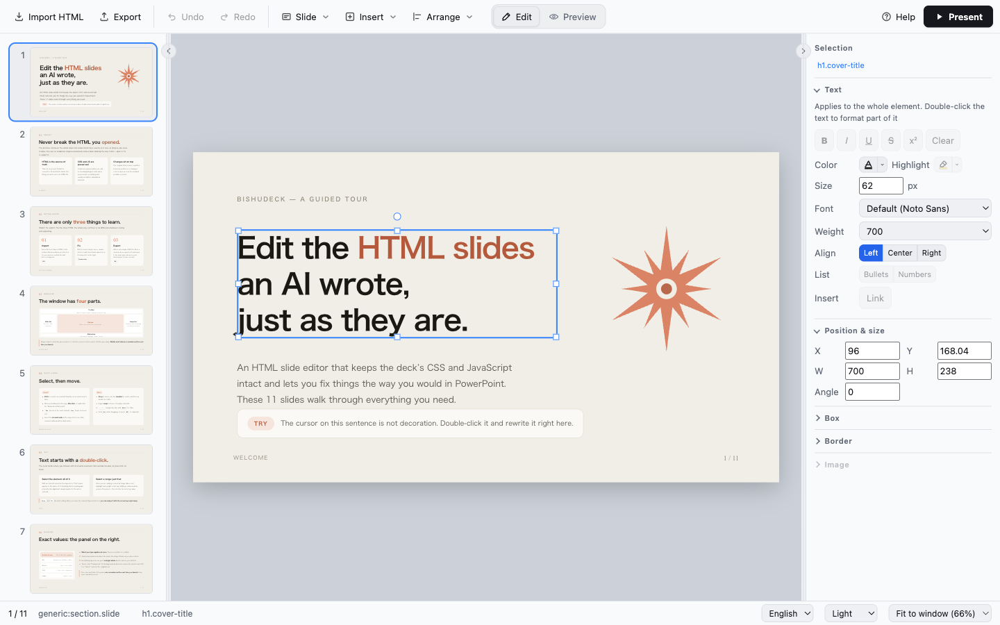
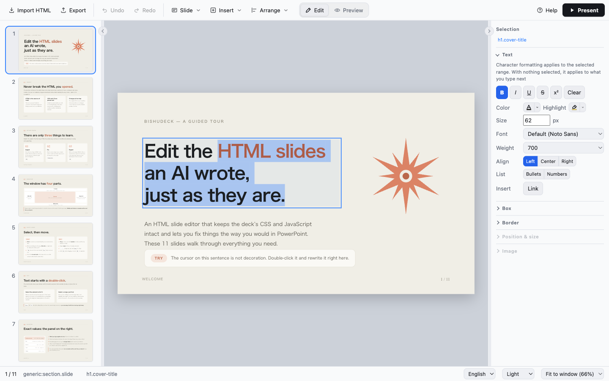
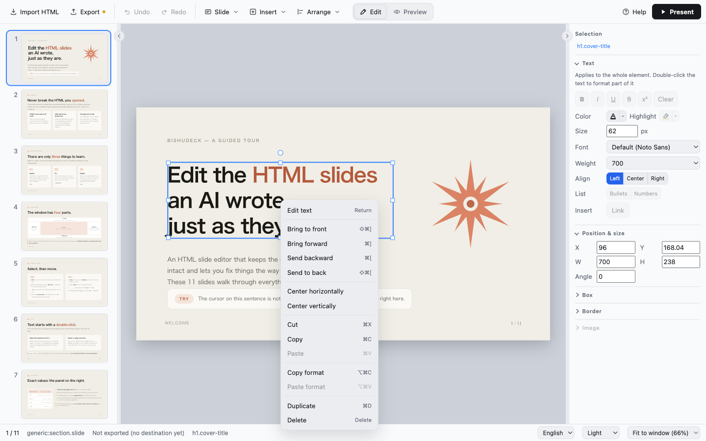

# Bishudeck

[](https://github.com/TominagaTeam/bishudeck/actions/workflows/ci.yml)

日本語: [README.ja.md](README.ja.md)

A desktop app (Tauri v2 + React + TypeScript) for editing the HTML slides an AI
generated, the way you would in PowerPoint — with the deck's own CSS and
JavaScript reproduced exactly as they are.



## What it does

- **Opens the HTML slides an AI made, as they are**

  Imports Claude Artifacts standalone exports, reveal.js, impress.js, Swiper and plain
  HTML, and splits them into individual slides. You see how the file will be split
  before it is imported.

- **Edits like PowerPoint**

  Click an element to select it, drag to move it, double-click to rewrite its text.
  Align, reorder, duplicate, copy & paste and undo / redo all work the way you expect.

- **Never breaks the deck's CSS and JavaScript**

  Edits are written as inline overrides; the original CSS is never touched.
  Elements the editor doesn't understand stay exactly as they were, as long as you
  leave them alone.

- **Exports a single HTML file**

  There is no project format. The deck is written back in the shape it came in, so
  the exported file opens in any browser.

- **Presents as is**

  A full-screen presentation window — and there, the deck's JavaScript runs.

## Building

Only the source is distributed, so you build it yourself.

**Requirements**

- Node.js 22 or later
- Rust
- The [Tauri v2 prerequisites](https://v2.tauri.app/start/prerequisites/)
  (Xcode Command Line Tools on macOS, the MSVC build tools on Windows)

**Steps**

```bash
git clone https://github.com/TominagaTeam/bishudeck.git
cd bishudeck
npm install
npm run tauri build
```

The `.app` / `.dmg` / `.msi` lands in `src-tauri/target/release/bundle/`.

On launch, an 11-slide guide to the editor opens, and you can start by playing with it.
The guide has no export destination, so closing it untouched asks nothing and nothing
is saved on its own. Importing your own HTML replaces it (there is nothing to delete).

The interface is in **English or Japanese**, following the language of your OS. You can
switch at any time from the right end of the status bar, and the choice is remembered.

## Using the editor

### The window

- **Top** — the toolbar: import, export, undo, slide, insert, arrange,
  edit / preview, help, present
- **Left** — the slide list. Drag to reorder
- **Center** — the slide being edited
- **Right** — the inspector. The selected element's formatting lives here
- **Bottom** — the status bar: save state, the selected element, language, theme, zoom

Drag the seam beside either side pane to resize it. Click the chevron on the seam to
fold the pane away, and again to bring it back. Widths and folds are remembered the
next time you launch.

### Selecting

- **Click to select. One element at a time** (there is no multi-select)
- An element that fills the whole slide is not selected by a click (the selection is
  cleared instead). That covers wrappers around the entire layout and background layers
  spread across the slide
- Anything with content of its own (an image, a video, an element with its own text)
  can be selected whatever its size
- To select a background layer itself, **walk the breadcrumb in the inspector**
- `Esc` steps one level out. At the outermost level it clears the selection

Hover the breadcrumb (`div.inner › h2`) and that element is outlined on the stage with a
dashed line. **You know which box it is before you click**, so a deck wrapped in layer
after layer never turns into guesswork.

### Moving, arranging, duplicating

- **Drag to move**; the handles on the selection frame **resize and rotate**
- **Arrow keys nudge by 1px** (`Shift` for 10px)
- The **Arrange** menu in the toolbar: alignment (left, center, …), stacking order
  (`⌘]` / `⌘[`), duplicate (`⌘D`)
- **Copy & paste** with `⌘C` / `⌘X` / `⌘V`

Paste lands **beside the selected element**. It goes into the same parent, so a grid cell
or a box the parent paints (`.container .card`) can be multiplied and still look right.
Paste with nothing selected and it goes straight onto the slide.

### Editing text



- **Double-click** to start editing. The caret lands where you clicked, with that word
  selected
- Leave by **clicking outside the box** or pressing `Esc`
- The element stays selected afterwards, so you can nudge it with the arrow keys right away

The inspector's **Text** panel is the one exception: **using it keeps the session going**.
The range you selected is not lost while you pick a font or a color.

### Changing appearance

From the inspector's panels.

| Panel | What it does |
| --- | --- |
| **Text** | bold, italic, underline, strikethrough, text color, highlight, size, font, weight, alignment, lists |
| **Position & size** | X / Y / W / H / angle as numbers. **Applied on every keystroke** |
| **Box** | fill (none / solid), padding, corner radius |
| **Border** | style (none / solid / dashed / dotted), color, width |
| **Image** | insert an image, crop |

Number fields also apply on the spot when you use the spinner arrows or a slider.
**Everything typed in one go is a single Undo** back to where you started.

**"None" is not "Reset".** "None" removes the background or border even where the deck's
own CSS paints one (it is written as an override). "Reset" removes the override itself and
**restores the deck's original look**.

The font list shows **only the fonts actually installed on this machine**. The exceptions
are **Noto Sans and Noto Sans JP**, which ship with the app and are therefore available
everywhere (the default is `Default (Noto Sans)`). When the exported HTML is opened on
another machine, it falls through to that machine's system fonts.

### Inserting images

**Any box that holds neither text nor an image** can take one.

- **Drop an image file** onto the box
- **Right-click** and choose "Insert image"
- The inspector's **Image › Insert image**

The photo frames an imported deck brings with it (dashed boxes labeled as photo
placeholders) work the same way. The deck's own drop feature is lost at import (it needs
the runtime of the environment the deck was made in), so this stands in for it.
An inserted image is **one Undo away**.

### Everything from the right-click menu



Edit text, stacking order, alignment, cut / copy / paste, copy / paste format, duplicate
and delete. When elements overlap at one spot, `Alt` + click (or "Elements at this point"
in the right-click menu) picks between them.

## How saving works

It is HTML all the way. There is no project format: "Import" reads an HTML file and
"Export" writes one. **Saving is exporting**, so `⌘S` and autosave take the same path.

**A deck that has an export destination** is autosaved to the same HTML file two seconds
after you stop editing. Writes go through a temporary file and an atomic rename, so a crash
midway leaves the previous version intact. The status bar reads "Unsaved changes" or
"Exported at HH:MM".

**A deck with no destination (only imported)** is never written on its own. The HTML it
was imported from is never silently overwritten either, for the same reason: you choose
the destination on the first export.

Only when you close the window with unexported changes does a dialog appear. The choices
are "Export and quit", "Quit without exporting" and "Cancel", and `Esc` is Cancel. If you
hit × by mistake, you go straight back to work.

## File format

The export is one HTML file. Imported images and the like go in an `assets/` folder
beside it.

```
presentation.html   the deck (original head, body and shell reproduced)
assets/*            imported images and the like
```

### Claude Artifacts standalone HTML

The "standalone" export from Artifacts is a self-unpacking loader with the content
embedded as JSON, so it is unpacked to plain HTML before it is split. A `<deck-stage>`
deck is recognized as **one slide per `<section>`**, and the stage size the deck declares
(1920×1080 and the like) is kept.

- Embedded fonts are kept only as far as the characters the deck actually uses, inlined
  into the HTML as `data:` URLs
- The runtime that **assembles** the deck (x-dc / React) is not imported. Instead,
  **what it would have drawn is folded into static HTML at import** — `{{ variables }}`
  become the defaults the components declare, and `<image-slot>` photo frames become
  placeholders that look the same. Both are ordinary elements you can edit
- The runtime that **presents** the deck (`<deck-stage>`) is kept. It is hidden while
  editing and **restored only in the exported HTML**, so the exported file opens the way
  the original standalone did: one slide at a time, thumbnails on the left, arrow keys
  to page through

## Not there yet

- **PDF export** and a **code view** have not been started
- **No multi-select** (the selection is always one element; walk the hierarchy with the breadcrumb)
- **No creating slides from scratch**. The input is an existing HTML deck
- `CONTRIBUTING.md` and `SECURITY.md` are in Japanese for now

## Development

- Before opening an issue or a pull request — [`CONTRIBUTING.md`](CONTRIBUTING.md) (Japanese)
- Reporting a vulnerability — [`SECURITY.md`](SECURITY.md) (Japanese)

**This repository is a per-release snapshot**; development happens in a separate
repository. A PR cannot be merged as it is (it gets re-applied), so please read
CONTRIBUTING before sending one.

## License

[MIT License](LICENSE)

Copyright TominagaTeam.

**Only the source is published**; there are no prebuilt binaries
(code signing and notarization are not set up yet).
