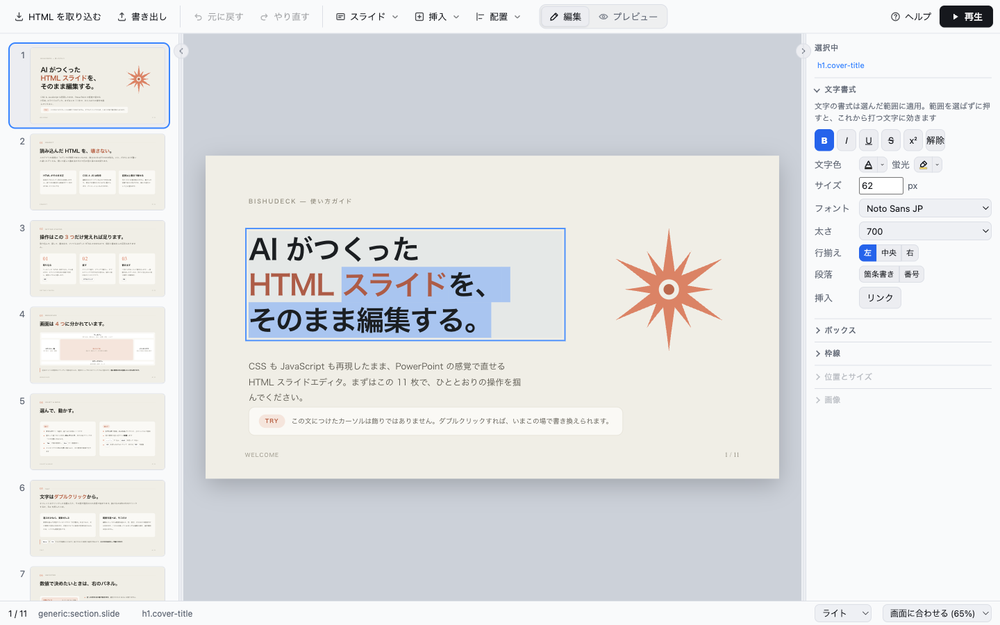
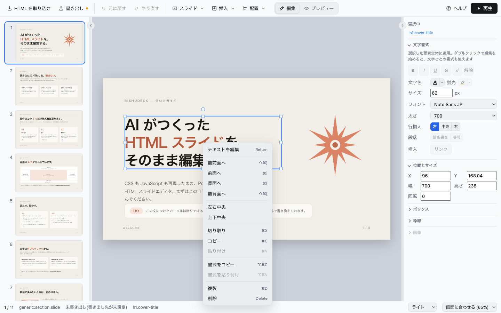

# Bishudeck

[](https://github.com/TominagaTeam/bishudeck/actions/workflows/ci.yml)

AI が生成した HTML スライドを、CSS も JavaScript もそのまま再現したまま
PowerPoint のように編集できるデスクトップアプリ(Tauri v2 + React + TypeScript)。


## できること

- **AI がつくった HTML スライドをそのまま開く**

  Claude Artifacts の standalone 書き出し・reveal.js・impress.js・Swiper・素の HTML を
  取り込み、1 枚ずつのスライドに分割します。どう分割したかは取り込み前に確認できます。

- **PowerPoint の感覚で直す**

  要素をクリックして選び、ドラッグで動かし、ダブルクリックで文字を打ち替える。
  整列・重ね順・複製・コピー & ペースト・Undo / Redo も同じ操作感で使えます。

- **デッキの CSS と JavaScript を壊さない**

  編集はインラインの上書きだけで行い、元の CSS には触りません。
  エディタが解釈できない要素も、触らなければそのまま残ります。

- **書き出すのは 1 枚の HTML**

  独自のプロジェクト形式を持ちません。読み込んだものと同じ形で書き戻すので、
  書き出したファイルはブラウザでそのまま開けます。

- **そのままプレゼンできる**

  再生ウィンドウで全画面表示。こちらでは JavaScript も動きます。

## ビルド

配布しているのはソースだけなので、手元でビルドして使います。

**必要なもの**

- Node.js 22 以降
- Rust
- [Tauri v2 の前提条件](https://v2.tauri.app/start/prerequisites/)
  (macOS なら Xcode Command Line Tools、Windows なら MSVC ビルドツール)

**手順**

```bash
git clone https://github.com/TominagaTeam/bishudeck.git
cd bishudeck
npm install
npm run tauri build
```

`src-tauri/target/release/bundle/` に `.app` / `.dmg` / `.msi` ができます。

起動すると使い方を説明する 11 枚のガイドが開くので、そこから触りはじめられます。
ガイドは書き出し先を持たないので、触らずに閉じても何も聞かれませんし、勝手に保存もされません。
自分の HTML を取り込めば置き換わります(消す操作は要りません)。

## 画面の使い方

### 画面の見かた

| 場所 | 何があるか |
| --- | --- |
| **上** | ツールバー。取り込み・書き出し・元に戻す・スライド・挿入・配置・編集 / プレビュー切替・ヘルプ・再生 |
| **左** | スライド一覧。ドラッグで並べ替えられます |
| **中央** | 編集中のスライド 1 枚 |
| **右** | インスペクタ。選んだ要素の書式がここに出ます |
| **下** | ステータスバー。保存の状態・選んでいる要素・テーマ・ズーム |

左右のペインは、境界をドラッグすると幅が変わります。境界のシェブロンをクリックすると
そのペインが隠れ、もう一度で戻ります。幅と開閉の状態は次回の起動にも残ります。

### 要素を選ぶ

- **クリックで選択。選べるのは 1 つずつ**です(複数選択はありません)
- スライドいっぱいに広がっている要素は、クリックしても選ばれません(選択が外れます)。
  レイアウト全体を覆うラッパーや、全面に敷いた背景レイヤーがこれにあたります
- 中身を持つもの(画像・動画・自前の文字を持つ要素)は、大きさに関係なく選べます
- 背景レイヤーそのものを選びたいときは、**インスペクタのパンくずから辿ります**
- `Esc` で 1 階層外へ。いちばん外まで来ると選択が外れます

パンくず(`div.inner › h2`)にマウスを乗せると、その要素がステージ上に破線で出ます。
**クリックする前にどの箱か分かる**ので、ラッパーが何重にもあるデッキでも
当てずっぽうに選び直さずに済みます。

### 動かす・並べる・複製する

- **ドラッグで移動**、選択枠のハンドルで**リサイズ・回転**
- **矢印キーで 1px ずつ**移動(`Shift` で 10px)
- ツールバーの「**配置**」から、整列(左揃え・左右中央 など)・重ね順(`⌘]` / `⌘[`)・複製(`⌘D`)
- **コピー & ペースト**は `⌘C` / `⌘X` / `⌘V`

貼り付け先は「**選んでいる要素の隣**」です。同じ親に入るので、grid のセルや
`.container .card` のように**親が塗っている**箱も、見た目そのままで増やせます。
選択を外して貼ると、スライドの上に直接置かれます。

### 文字を直す



- **ダブルクリック**で文字編集に入ります。キャレットはクリックした位置に入り、その語が選択されます
- 抜けるのは、**枠の外をクリック**するか `Esc`
- 抜けたあとは要素の選択が残るので、そのまま矢印キーで動かせます

インスペクタの「**文字書式**」だけは例外で、**触っても編集が続きます**。
フォントや色を選んでいる間に、選んだ文字の範囲が失われません。

### 見た目を変える

インスペクタのパネルから変えます。

| パネル | できること |
| --- | --- |
| **文字書式** | 太字・斜体・下線・打ち消し・文字色・蛍光・サイズ・フォント・太さ・行揃え・箇条書き |
| **位置とサイズ** | X / Y / 幅 / 高さ / 回転を数値で。**1 文字打つたびに反映されます** |
| **ボックス** | 背景(透明 / 単色)・余白・角丸 |
| **枠線** | 種類(なし / 実線 / 破線 / 点線)・色・太さ |
| **画像** | 画像を入れる・トリミング |

数値の欄は、上下の矢印(スピナー)やスライダーを動かしてもその場で反映されます。
**打っているあいだの変更はまとめて 1 回の Undo** で打つ前に戻ります。

**「なし」「透明」と「解除」は違います。** 前者はデッキ自身の CSS が塗っている背景や
枠線も消します(上書きとして書くため)。後者は上書きそのものをやめて、
**デッキ本来の見た目に戻します**。

フォントの一覧には、**この環境に実際に入っているものだけ**が出ます。例外は
**Noto Sans と Noto Sans JP** で、この 2 つはアプリが同梱しているのでどの環境でも選べます
(既定は `既定(Noto Sans)`)。書き出した HTML を別の機械で開いたときは、
その環境のシステム書体に落ちます。

### 画像を入れる

**文字も画像も持たない箱**なら、どれでも画像を入れられます。

- 画像ファイルを**その箱の上に落とす**
- **右クリック**して「画像を入れる」
- インスペクタの「**画像 › 画像を入れる**」

取り込んだデッキが持っている写真枠(破線の箱に「写真添付エリア: …」と書いてあるもの)も
同じように扱えます。デッキ本来のドロップ機能は取り込みの時点で失われている
(動かすにはデッキを作った環境のランタイムが要る)ので、これがその代わりです。
入れた画像は **Undo 1 回で戻せます**。

### 右クリックからまとめて



テキスト編集・重ね順・整列・切り取り / コピー / 貼り付け・書式のコピー / 貼り付け・
複製・削除が並びます。同じ位置に要素が重なっているときは、
`Alt` + クリック(または右クリックの「この位置にあるもの」)で選び分けられます。

## 保存の挙動

扱うのは HTML だけです。専用のプロジェクト形式はなく、「取り込む」で HTML を読み、
「書き出し」で HTML を書きます。**保存 = 書き出し**なので、`⌘S` も自動保存も同じ経路を通ります。

**書き出し先が決まっているデッキ**は、編集の手が 2 秒止まると同じ HTML へ自動保存されます。
書き込みは一時ファイル経由の atomic rename なので、途中で落ちても直前の版は残ります。
ステータスバーに「変更あり / 書き出し済み HH:MM」が出ます。

**書き出し先が未設定(取り込んだだけ)のデッキ**は、勝手に書き出しません。取り込み元の
HTML を黙って上書きしないのも同じ理由で、書き出し先は最初の書き出しでユーザーが決めます。

未書き出しのままウィンドウを閉じようとしたときだけ、確認ダイアログが出ます。
選べるのは「書き出して終了」「書き出さずに終了」「終了をキャンセル」の 3 つで、
`Esc` はキャンセルと同じです。× を押し間違えただけなら、そのまま作業に戻れます。

## ファイル形式

書き出すのは 1 枚の HTML ファイルです。取り込んだ画像などは、その HTML と同じ階層の
`assets/` に並べて置かれます。

```
presentation.html   デッキ本体(元の head・body・シェルごと再現)
assets/*            取り込んだ画像等
```

### Claude Artifacts の standalone HTML

Artifacts の「standalone」書き出しは、中身が JSON で埋め込まれた自己展開型のローダーなので、
取り込み時に素の HTML へ戻してから分割します。`<deck-stage>` のデッキは
**スライド 1 枚 = `<section>` 1 個**として認識され、デッキが宣言しているステージサイズ
(1920×1080 等)もそのまま引き継ぎます。

- 埋め込みフォントは、デッキが実際に使う文字を覆う分だけ残して `data:` で HTML に同梱します
- デッキを**組み立てる**ランタイム(x-dc / React)は取り込みません。かわりに
  **描くはずだった結果を取り込み時に静的な HTML へ畳み込みます** —— `{{ 変数 }}` は
  コンポーネントが宣言している既定値になり、`<image-slot>` の写真枠は同じ見た目の
  プレースホルダになります。どちらもそのまま編集できる普通の要素です
- デッキを**プレゼンする**ランタイム(`<deck-stage>`)は逆に保持します。編集中は出さず、
  **書き出す HTML にだけ戻す**ので、書き出したファイルは元の standalone と同じく
  1 枚ずつ・左サムネイル・矢印キー送りで開きます

## まだできないこと

- **PDF 書き出し**と**コードビュー**は未着手です
- **要素の複数選択**はありません(選択は常に 1 つ。階層はパンくずで辿ります)
- **スライドをゼロから作る機能**はありません。入力は既存の HTML デッキです
- **UI の文言は日本語のみ**です

進捗の詳細は [`docs/roadmap.md`](docs/roadmap.md) にあります。

## 開発

- 設計ドキュメントの入口 — [`docs/INDEX.md`](docs/INDEX.md)
- Issue / Pull Request を送る前に — [`CONTRIBUTING.md`](CONTRIBUTING.md)
- 脆弱性の報告 — [`SECURITY.md`](SECURITY.md)

**このリポジトリはリリースごとのスナップショット**で、開発は別のリポジトリで進んでいます。
PR をそのままマージできない(取り込み直す形になる)ので、送る前に CONTRIBUTING を読んでください。

## ライセンス

[MIT License](LICENSE)。著作権者は TominagaTeam。

公開しているのは**ソースだけ**で、ビルド済みのバイナリは置いていません
(コード署名と公証の準備ができていないため)。
