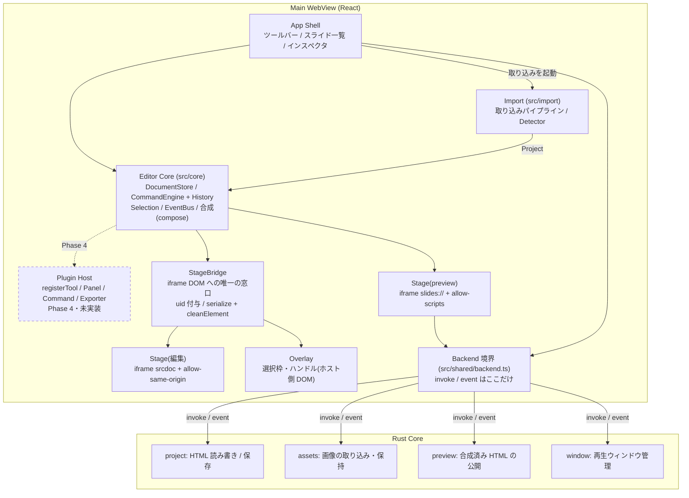
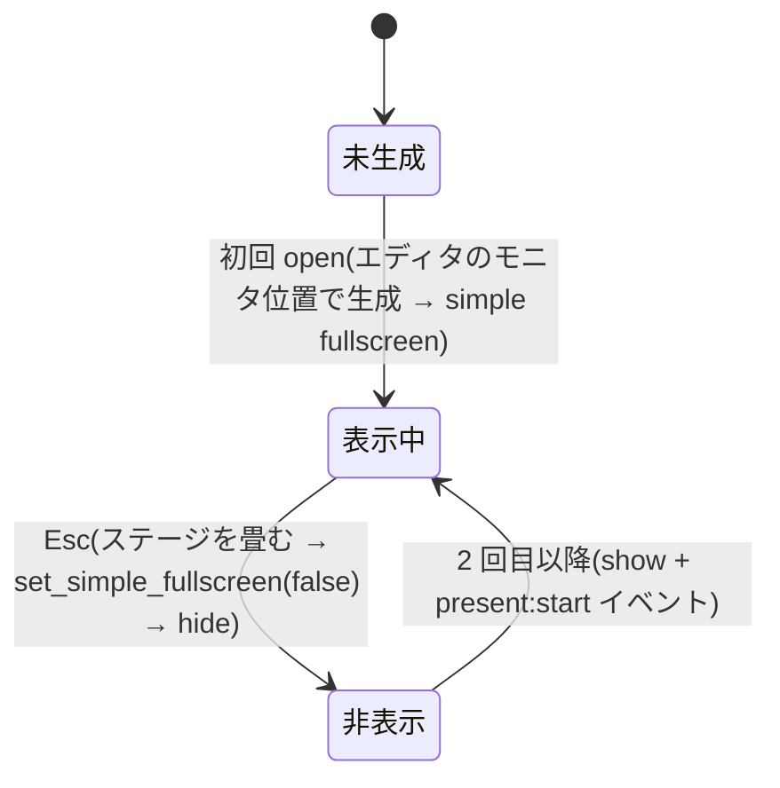
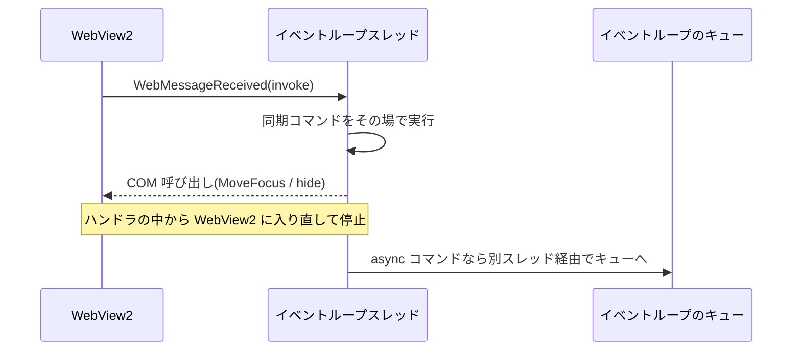

# アーキテクチャ / 処理フロー(全体)

機能ごとの詳細フローは [../features/](../features/) 配下へ。ここは全体像のみ。

## 全体構成図



**iframe の DOM に触るのは StageBridge だけ**。触り方が散らばるとシリアライズ時の掃除漏れが起きる。
エディタが描く選択枠・ハンドルは iframe の中ではなく**ホスト側**に描く(書き出し HTML に混ざらないため)。

- **取り込みとスライドのシリアライズは Editor Core の中に無い**。
  取り込み(`analyzeHtml` / `buildProject`)は `src/import` の箱で、Core の中ではなく
  **その横に立つ独立した層**(理由は下の「レイヤ構成・依存の方向」)。
  スライドを HTML 文字列に戻すのは StageBridge の `serializeSlide()` + `cleanElement()`
  (`src/stage/bridge.ts`)で、**iframe の DOM に触れる唯一の場所と同じ箱**に置いてある ——
  掃除(`data-hse-*` / `contenteditable` の除去)は DOM を触った本人にしかできないため。
  Core に残るのは**デッキ全体の合成**で、`core/document/compose.ts` が
  編集 srcdoc・プレビュー・書き出しの 3 モードを 1 箇所で組み立てる
- **Rust を呼ぶのは Backend 境界の 1 点だけ**(不変条件 10。集約する理由は下の
  「レイヤ構成・依存の方向」)。`invoke` も `present:start` の購読も `src/shared/backend.ts` にある。
  **`src/core` からはこの箱へ 1 本も出ていない** —— 実際に叩くのは App Shell
  (`app/App.tsx` / `app/Present.tsx` / `app/actions.ts` / `app/autosave.ts` / `features/Toolbar.tsx`)と
  **プレビューステージ**(`stage/PreviewStage.tsx` が合成した HTML を `publish_preview` に預けて
  `slides://` の URL を受け取る)。`shared/assetBase.ts` も起動時に一度 `preview_base_url` を引くが、
  横断層なので図には出さない
- **Plugin Host はまだ無い**(図の破線)。[ADR-0005](../adr/0005-core-features-on-plugin-api.md) は**保留**のままで、
  `src/plugins/` は存在しない。Phase 4 で採り直すか追認するかを決めるまでの**受け皿**として図に残している。
  API の形は [11-extensibility.md](11-extensibility.md)、置き場の計画は [05-directory.md](05-directory.md)
- **Rust 側の箱は `src-tauri/src/commands/` の 4 モジュールと 1 対 1**。
  `preview` を `assets` に混ぜないのは責務が違うため —— `preview` は**合成済み HTML を預かって URL を返す**
  (`publish_preview` / `clear_previews` / `preview_base_url`)、`assets` は**画像のバイト列を預かる**
  (`import_asset` / `put_asset_bytes` / `list_assets`)。合成は WebView 側でやるので、
  どちらの箱も HTML を解釈しない
- **`slides://` の配信そのものは箱の外**。`src-tauri/src/protocol.rs` が 1 本のルータで
  `/s/{id}`(preview の公開分)と `/assets/{name}`(assets の保持分)の両方を配る。
  つまり**入口はコマンドで分かれ、出口は共通**。別オリジンで配ることが sandbox の前提になっている
  ([10-security.md](10-security.md))

## レイヤ構成・依存の方向

```
App Shell (src/app, src/features)
    ↓ 依存してよい            ↘ 取り込みを起動する
Editor Core (src/core)  <───  Import (src/import)
    ↕ 双方向(理由は下記)      core/document と shared にしか依存しない
Stage (src/stage) ── iframe 境界 ──> 取り込んだデッキの DOM
    ↓
Backend 境界 (src/shared/backend.ts)
    ↓ invoke
Rust Core (src-tauri)

Shared (src/shared) — i18n / fonts / ids / platform / shortcuts / assetBase
    ↑ 上のどの層からも呼ばれる(縦の並びの外にある横断層)
```

- **逆流させない**。`src/core` が `src/features` の画面部品を知ってはいけない
- **`core` と `stage` のあいだだけは双方向**。テストを除いた import 文の実測で
  `stage → core` が **24 本**、`core → stage` が **7 本**ある。
  **これは避けられない** —— 不変条件 7 で **iframe の DOM に触れるのは StageBridge だけ**と決めた以上、
  `core` は自前の DOM 層を持てず、**要素の測定と transform の読み書きは `stage` にしか置けない**。
  実装側も同じことを言っている: インスペクタの数値入力を**パネルではなく `core/editing/geometry.ts` に置いたのは
  「ステージと履歴に触るから、UI ファイルはそれをしてよくない」**で、
  同ファイルの冒頭は `stage/geometry.ts` を「もう半分(read 側)」と呼んでいる
- **`core → stage` の 7 本は性質が 2 つに割れる**。
  - **型のみ 3 本** — `core/commands/engine.ts` / `core/commands/types.ts` / `core/editing/actions.ts` の
    `import type { StageBridge }`。**Command が何に `apply` するか**そのもので、
    [ADR-0003](../adr/0003-all-edits-as-commands.md) の構造から出てくる。実行時の依存にはならない
  - **値 4 本** — `core/editing/{geometry,crop,actions}.ts` が `stage/geometry` の
    `boxOf` / `readTransform` / `writeTransform` / `resizeKeepingAnchor` / `boundsOf` /
    `unionBounds` / `round` を使い、`core/editing/textBox.ts` が `stage/textEditRequest` 越しに
    テキスト編集の開始を頼む
- **`stage/geometry.ts` の export も 2 種類ある**。生きた `HTMLElement` を測る / 書く
  (`boxOf` / `readTransform` / `writeTransform`)と、DOM に触らない純粋な数学
  (`resizeKeepingAnchor` / `boundsOf` / `unionBounds` / `rotateVector` / `round`)。
  後者を別の層へ動かすことはしていない —— ドラッグ(`stage/interactions.ts`)と
  数値入力(`core/editing/geometry.ts`)が**同じ 1 ファイルの同じ式**を使っている状態を保つため
- **`src/import` は App Shell の一部ではなく、`core` の横に立つ独立した層**。
  取り込みを**起動する**のは App Shell(`app/actions.ts` の `importHtml`、分割を確定する
  `app/importStore.ts` と `features/ImportDialog.tsx`)だが、`src/import` 自身が依存するのは
  `core/document/{model,compose}` と `shared/{ids,i18n}` だけで、
  `app` / `features` / `stage` はどれも知らない。
  `core/document/compose.ts` は往復の相方でも `src/import` を import しないので、
  **依存は取り込み側からの片方向**で循環しない(`core` / `stage` から参照しているのはテストだけ)
- **`src/shared` は最下層ではなく横断層**。縦の並びに `backend.ts` だけが出てくるのは、
  これが**バックエンド境界**という別の役割を負っているからで、`shared/` 全体が下にあるわけではない
- **UI 文言カタログ `shared/i18n` はほぼ全域が依存する**。テストと `shared` 内の自己参照
  (`shared/shortcuts.ts`)を除いて 34 ファイル
  (`core` 8 / `features` 13 / `app` 4 / `import` 4 / `stage` 4 / `src/main.tsx`)が import し、
  `src/main.tsx` は**何かを描く前に** `initLocale()` を呼ぶ(コマンドのラベルは生成時に読まれるので、
  あとから言語が決まると先に組んだ分が古い言語のまま残る)。`t()` は hook ではなく素の関数なので、
  **`core` が React に依存しない制約は破れていない**([features/i18n](../features/i18n/design.md))
- **Rust 側は HTML を解釈しない**([ADR-0001](../adr/0001-html-as-source-of-truth.md))。
  ファイル I/O・アセット配信・プレビュー公開・ウィンドウ管理の 4 つに徹する
  (「全体構成図」の 4 つの箱と 1 対 1)。**預かることは解釈することではない** ——
  プレビュー公開は合成済み HTML を文字列のまま持って URL を返すだけで中身を読まないので、
  4 つ目を数えても「解釈しない」は成り立つ。HTML の知識を二重実装しない
- **自作 Rust コマンドの `invoke` は `src/shared/backend.ts` に集約する**。
  ここが唯一のバックエンド境界。`invoke` を 1 点に集めておくと、
  Tauri の外(ブラウザ・テスト)で動かすときも**ここだけ差し替えれば上の層はそのまま動く**
- 配置ルールの詳細は [05-directory.md](05-directory.md)

## 主要な処理フロー

### 取り込み → 編集 → 書き出し

```mermaid
graph LR
    A[HTML ファイル] -->|Rust: project| B[生 HTML 文字列]
    B -->|DOMParser + Detector| C[Slide[] + SharedResources]
    C -->|srcdoc 合成| D[編集ステージ]
    D -->|ジェスチャ / インスペクタ| E[Command]
    E -->|apply| D
    E -->|履歴| F[History]
    D -->|serialize + cleanElement| G[HTML 文字列]
    G -->|Rust: atomic rename| H[保存 / 書き出し]
```

詳細は [../features/import-pipeline/flow.md](../features/import-pipeline/flow.md) と
[../features/editing-engine/flow.md](../features/editing-engine/flow.md)。

### モードの切り替え

編集モードとプレビューモードで iframe の構成そのものを変える。
この 2 つの sandbox 属性の組み合わせを**入れ替えてはならない**。詳細は
[ADR-0002](../adr/0002-edit-preview-separation.md) と [10-security.md](10-security.md)。

**プレビュー合成の足場(空スライドのプレースホルダ・ナビ注入)は preview モード限定**。
編集ステージや書き出し HTML に漏らさない。

## 再生ウィンドウのライフサイクル

再生ウィンドウ(F10)は**一度だけ生成し、以後は hide / show で使い回す**。終了しても `close()` しない。



### なぜ close() しないか

WKWebView を破棄すると、Web プロセスから飛んでくる layer-tree コミットが
破棄済みの display link を参照して UI プロセスごと落ちる
(`RemoteLayerTreeDrawingAreaProxyMac::displayLink` で SIGSEGV。wry 0.55 / macOS で再現)。
フルスクリーン + アニメーションするデッキという再生ウィンドウの条件はこのレースを踏みやすい。
破棄しなければレースの起点が無いので、ウィンドウは常駐させる。

### なぜ simple fullscreen か

ネイティブフルスクリーンは専用スペースを作り、`set_fullscreen(false)` は退出アニメーションを
「開始する」だけなので、その途中で `hide()` するとレースに負ける
(AppKit が退出完了時にウィンドウを order in し直し、ステージを畳んだあとの空のウィンドウが画面に残る)。
simple fullscreen は同期的に適用・解除されるため、直後の `hide()` が確実に効く。
macOS 以外は Tauri 側で `set_fullscreen` に落ちる。

simple fullscreen は Dock とメニューバーを**アプリ単位**で隠すので、解除せずに hide すると
エディタ側が Dock なしのまま取り残される。終了時に必ず解除する。

### simple fullscreen のあとにキーボードを取り返す

simple fullscreen は `NSWindowStyleMask::Titled` を落とすことで実現されている。
styleMask を変えると AppKit が first responder を捨てるので、tao は自分の `ns_view` を
first responder に戻す(`util::toggle_style_mask`)。WKWebView はその view の**サブビュー**で、
キーイベントは responder chain を上にしか流れないため、切り替え後の再生ウィンドウは
`keydown` を一切受け取らなくなる — ←/→/Esc が全部無反応になり、macOS が警告音を鳴らす。

ウィンドウの `set_focus`(= `makeKeyAndOrderFront:`)では直らない。
あれが決めるのは「どのウィンドウが key か」であって「その中のどの view がキーボードを持つか」ではない。

取り返し方は **再生ウィンドウ自身が `focus_presentation_webview` を invoke する**。
コマンド引数の `Webview` は呼び出し元そのものなので、安定 API のまま目的の view を掴める
(`Manager::get_webview` は tauri の `unstable` feature 限定)。
`open_presentation_window` は `set_simple_fullscreen` → `set_focus` → `present:start` の順に呼び、
この invoke が styleMask 切り替えの**あと**に来るようにしている。

### 再生中はステージの上にクリックシールドを敷く

プレビュー用の iframe は `slides://` の別オリジンなので、クリックでフォーカスがその中に落ちると
ホスト側の keydown リスナには二度と届かない(編集ステージの `.stage-interaction` と同じ理由)。
`.stage-shield` はクリックを吸って、左半分で前・右半分で次に送る
(PowerPoint / `deck-stage` 自身の tap と同じ)。
引き換えに、再生中はデッキ内のボタン・リンクが押せない。エディタのプレビューペインには敷かない。

### macOS 以外 — キーボードは奪われないが、同期コマンドが刺さる

ここまでの 3 節はすべて Cocoa の事情で、macOS 以外には無い問題。
`set_simple_fullscreen` は Tauri が `set_fullscreen` に落とすので styleMask の切り替えも起きず、
first responder という概念自体が無い。**したがって `focus_presentation_webview` は
macOS 以外では意図的に何もしない**(呼び出し側は分岐しない。理由を `commands/window.rs` 1 箇所に置くため)。

代わりに Windows には逆向きの罠がある。**再生ウィンドウを触るコマンドを同期(`fn`)で書くと固まる。**



Windows では invoke が WebView2 自身の `WebMessageReceived` ハンドラで届き、それは
イベントループスレッドで走る。`tauri-runtime-wry` の `send_user_message` は
**そのスレッドからの依頼をキューせずその場で処理する**ので、同期コマンドは
「WebView2 のイベントハンドラの中から WebView2 の COM を呼ぶ」形になり、再入して止まる。
Tauri が `WebviewWindowBuilder::build` の Known issues に書いている
"deadlocks when used in a synchronous command and event handlers" と同じ罠で、
**ウィンドウ生成に限った話ではなく、ウィンドウ / webview を触る呼び出し全部に効く**。

`commands/window.rs` の 3 コマンドを**すべて `async fn`** にしてあるのはこのため。
async なら別スレッドで走り、依頼はイベントループにキューされる。
macOS では同期でも動いてしまうので、**壊れていることに気づけるのは Windows だけ**(不変条件 20)。
