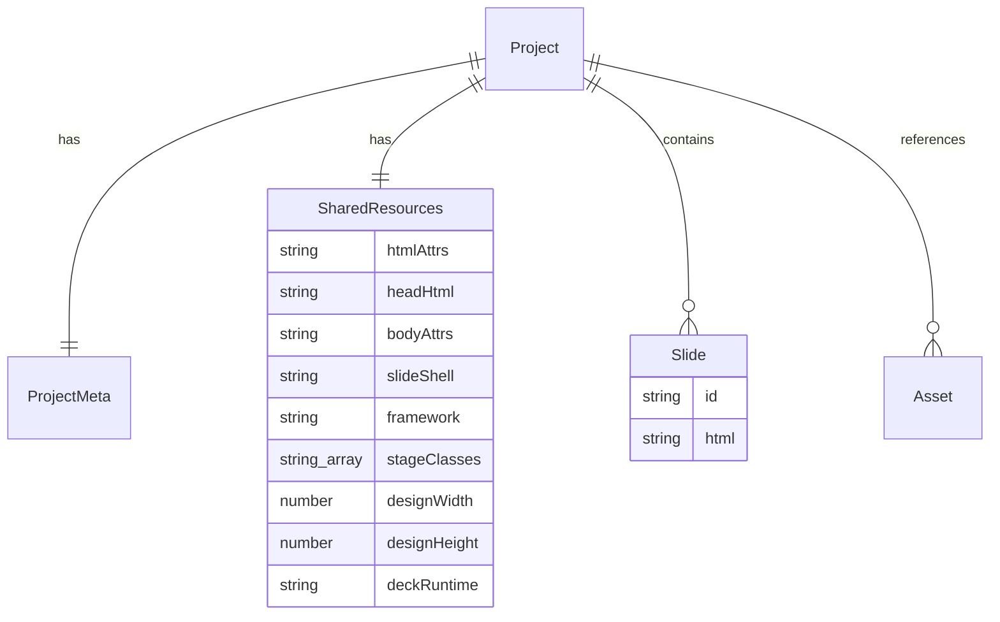

# データモデルとファイル形式

## スキーマの正の場所

**[`src/core/document/model.ts`](../../src/core/document/model.ts) が正**
([ADR-0006](../adr/0006-docs-driven-migration.md) 裁定 7)。
各フィールドの「なぜそれが要るか」はそこの doc コメントに書いてある。
ここには概念レベルの構造と、コードだけでは読み取れない設計判断を書く。

**モデルを変えたら `model.ts` の doc コメントとこの章の両方を直す。**
ズレたときはコードが勝つが、黙って乖離させない(移行前の設計書は
`slideShell` / `stageClasses` / `designWidth` / `assets` を 1 つも記載しておらず、
実装に無い `Slide.overriddenHead` を載せていた)。

## エンティティ一覧

| エンティティ | 役割 |
|---|---|
| `Project` | デッキ 1 つ分。メタ情報 + 共有リソース + スライド列 + アセット名の一覧 |
| `SharedResources` | 全スライドに共通するもの。`<head>` の中身、`<html>`/`<body>` の属性、スライドを差し戻す「殻」、ステージサイズ |
| `Slide` | スライド 1 枚。**`html` が正データ**(自分の最外要素を含むフラグメント) |



## 設計上の注意

### 正データは HTML 文字列

`Slide.html` がスライドの正データ([ADR-0001](../adr/0001-html-as-source-of-truth.md))。
派生データ(サムネイル・uid・編集状態・選択)は**モデルに含めない**。キャッシュ扱い。

### `slideShell` — スライドを差し戻す殻

元の body markup からスライドを全部抜き、最初の 1 枚があった位置に `SLIDE_SLOT` の
マーカーコメントを残したもの。スライドを描くとはこの穴に HTML を落とすこと。
これによりデッキが依存していたラッパー構造(`.reveal > .slides`、固定ヘッダ等)が
**元のまま**復元される。

### `stageClasses` — 表示中スライドに付くクラス

多くのデッキは既定で全スライドを隠し、`is-active` 等が付いた 1 枚だけを見せる。
このクラスが無いとスライドを単独で描いたとき真っ白になる。

**これは描画の都合であって、スライド自身の markup には決して書き込まない。**
書き出し時はデッキ本来の active 状態を再現する。

### `designWidth` / `designHeight` — 論理ステージサイズ

スライドはこのサイズちょうどで描画してから fit スケールで縮小する。
`100vh` を使ったレイアウトがウィンドウサイズに影響されなくなる。
既定は 1280×720。デッキが宣言していればそれを引き継ぐ(Artifacts の `<deck-stage>` なら 1920×1080 等)。

### `deckRuntime` — 書き出しにだけ戻すランタイム

デッキ自身のプレゼンランタイム(1 枚表示・サムネイルレール・矢印キー送り)。
**取り込み時に殻から取り出し、書き出しを合成するときだけ戻す。**
編集中に動かすと、キャンバスの上にデッキ側のサムネイルレールと 1 枚表示が重なる。
詳細は [../features/import-pipeline/design.md](../features/import-pipeline/design.md)。

### ID はセッション内でのみ有効

`Slide.id` は ULID だが、**ファイルには残らない**編集用ハンドル。
永続化する形式が HTML だけなので、ID と履歴はディスクに残せない。

## 永続化する形式は HTML だけ

専用のプロジェクト形式(zip コンテナ等)は**持たない**。ディスク上にあるのはこれだけ。

```
presentation.html        # 元の head / body / シェルごと再合成したデッキ本体
assets/
 ├─ asset_001.png        # 取り込んだローカルアセット
 └─ ...
```

- 扱う対象が AI 生成 HTML である以上、正データは最初から HTML([ADR-0001](../adr/0001-html-as-source-of-truth.md))。
  独自コンテナを挟むと「編集用の形式」と「配れる形式」が二重管理になり、
  どちらが最新かをユーザーが管理する羽目になる
- 代償として、スライド ID と履歴はファイルに残らない
- HTML 内のアセット参照は取り込み時に `assets/...` 相対パスへ書き換える

**保存 = 書き出し**。⌘S も自動保存も同じ経路(一時ファイル経由の atomic rename)を通る。

## エクスポート

| 形式 | 状態 |
|---|---|
| 単一 HTML(`shared.headHtml` + 各スライドを元の構造で再合成) | 実装済み |
| アセットの base64 インライン化 / 同梱フォルダの選択制 | **未実装**(現状は常に `assets/` へ同梱) |
| PDF(再生ウィンドウで印刷 CSS 1 スライド = 1 ページ + WebView 印刷) | **未実装**(F11 / Phase 3) |

書き出した HTML に何を残してよいかの判定基準は
[../features/import-pipeline/design.md](../features/import-pipeline/design.md) の「書き出しに残してよいもの」。
