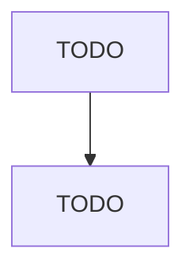

# {{FEATURE_NAME}} — 処理フロー

## メインフロー

<!-- TODO(interview): 正常系の処理の流れは？（入力 → 処理 → 出力を順に）回答をもとに Mermaid で図示し、ユーザーに確認する -->

## 異常系・エッジケース

<!-- TODO(interview): 失敗するのはどんなとき？そのときどうする？（エラー表示 / リトライ / 無視） -->

## 状態遷移（あれば）

<!-- TODO(interview): この機能に状態を持つものはある？（例: 注文の未処理→処理中→完了）あれば Mermaid stateDiagram で図示 -->
