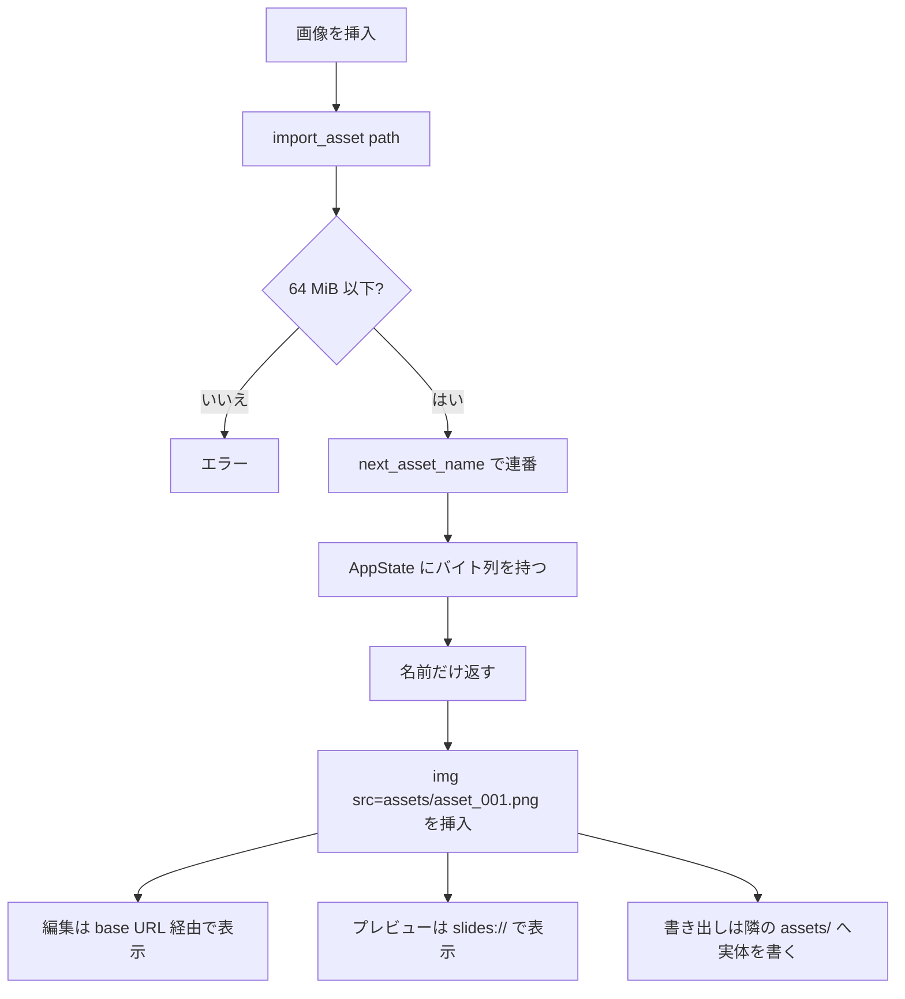

# asset-pipeline — 処理フロー

## メインフロー

## 異常系・エッジケース

| ケース | どうなるか |
|---|---|
| 64 MiB 超 | `AppError::Invalid`。取り込まない |
| 拡張子が無いファイル | `asset_001`(拡張子なし)。MIME は配信時に推測される |
| 名前が衝突する | `next_asset_name` が空きが出るまで番号を進める |
| 存在しないアセットが要求される | `slides://` が 404 を返す |
| 書き出し先に親ディレクトリが無い | `AppError::Invalid`。パスに親が無いのは異常 |
| ブラウザで動かしている(`npm run dev`) | `previewBaseUrl()` が失敗 → base 無し。相対パスのまま動く |
| アプリを終了する | **バイト列は消える。** 書き出し済みなら隣の `assets/` に残っている |

## 溜まる一方であること

差し替えや削除で参照されなくなったアセットも `AppState` に残り、
**書き出しのたびに `assets/` へ書かれる**。実害が出るのは
大きな画像を何度も差し替えたときで、現状は既知の妥協。
