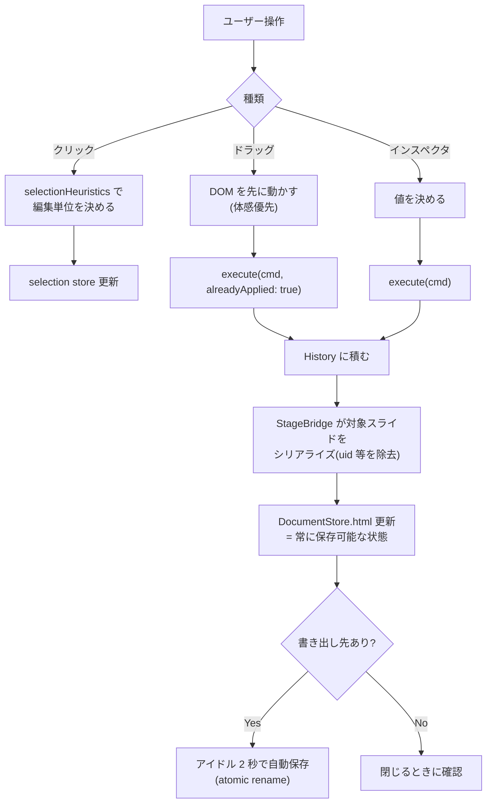
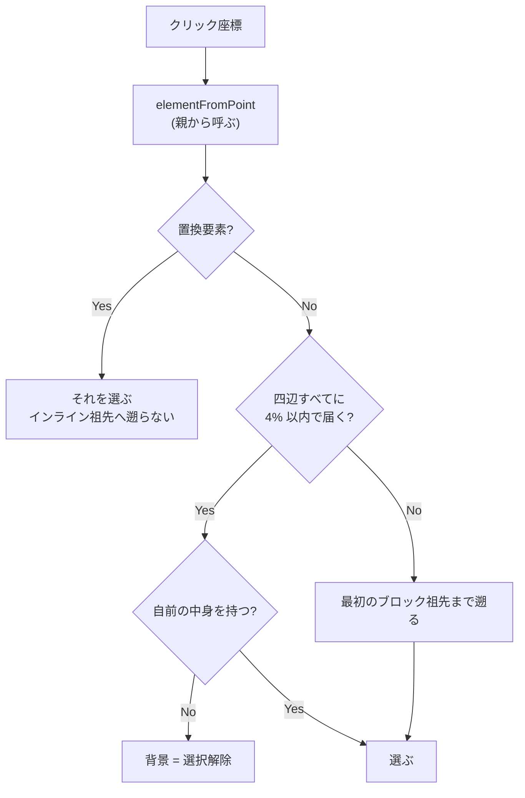
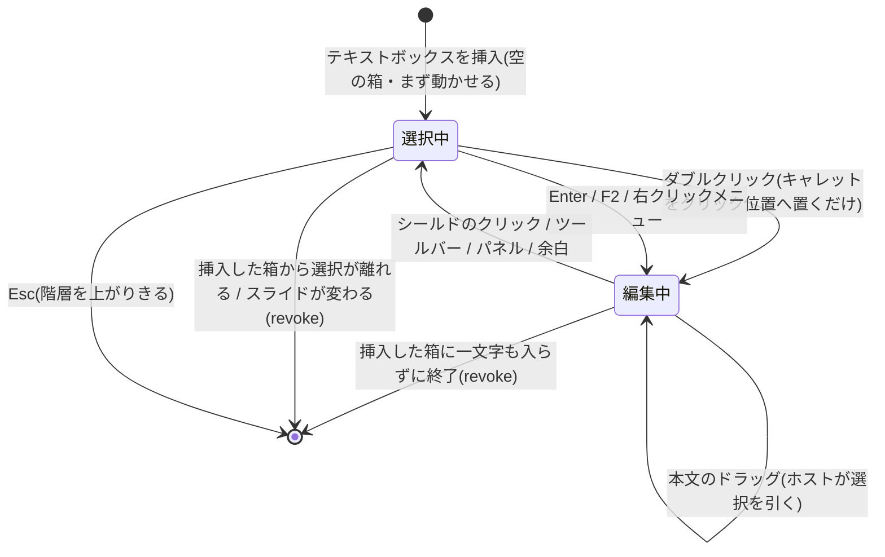
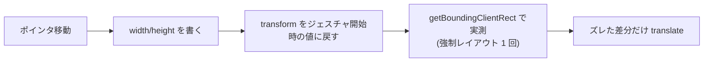

# editing-engine — 処理フロー

## メインフロー(編集 1 回)

**DOM を先に触るジェスチャも必ず履歴に載せる**(`alreadyApplied: true`)。
Command を経由しない編集経路を作らない([ADR-0003](../../adr/0003-all-edits-as-commands.md))。

## 選択の決定

## テキスト編集セッション

**挿入は編集セッションを開かない。** 空の箱は選択された状態で置かれ、
入口 3 つ(ダブルクリック・Enter / F2・右クリックメニュー)はどれも
**挿入直後の 1 件に限って空の箱を通す**([design.md](design.md) の
「新しいテキストボックスは空で入る」)。

**本文の上もホスト側の 1 枚**(`.overlay-text-shield`)。press をフレームに渡さないので、
選択済み範囲の上からでもドラッグで引き直せる([issues](../../issues.md) #17)。
キャレット・単語(2 連打)・要素全体(3 連打)・Shift 拡張は `src/stage/textSelection.ts` が持つ。

セッションを閉じるときは **基準からの差分を記録 → 選択レンジを消す → 要素を blur →
操作レイヤにフォーカス** の順。`contenteditable` を外すだけだとホストに key イベントが届かなくなる。
記録の基準(履歴が到達済みのマークアップ)は書式適用のたびに進むので、
終了時に積まれるのは**そのあとに入力した分だけ**([design.md](design.md) の「標準コマンド」)。

## リサイズ(実測して戻す)

**予測しない。** どれだけ動くかは要素ではなく周囲のレイアウトの性質で決まるので、
予測すると必ずどれかのケースで外れる。

## 異常系・エッジケース

| 状況 | 挙動 |
|---|---|
| **WKWebView で iframe 内の Esc を押した** | 効かない(スクリプト無効 document ではリスナが発火しない)。出口はホスト側要素のクリック — シールド・ツールバー・パネル・余白 |
| **選択済みの範囲の上で press した** | ホスト側のシールドが受けるので、ブラウザのネイティブドラッグにならず新しい選択になる |
| ドラッグが編集中要素の外へ出た | 直前に枠内だった位置で止める(選択は崩れない) |
| ネイティブ select / カラーダイアログにフォーカスを奪われた | pointerdown(capture)の瞬間に Range を退避し、コマンド直前に復元する |
| `focus()` が人工的なキャレットを作った | **信用しない**。復元をスキップする根拠にしない |
| 位置入力に数値を入れたまま別の要素をクリックした | focus 時点で退避した uid に対して確定する(**今の選択を読まない**) |
| 値を変えずにタブで通り抜けた | コマンドを積まない(空の undo ステップを作らない) |
| 選択が変わった直後の 1 レンダリング | uid が一致しない computed 読み取りは捨て、空として描く |
| 復元した markup が古い uid を持たない | その uid を選択から落とす |
| フォントを 2 回続けて選んだ | 1 回目の書き換えで生成した span を選択し直してあるので空振りしない |
| 測定用 canvas が無い環境 | フォントカタログを丸ごと出す(隠すより出すほうが安全側) |
| 幅の実測が 0 | 「証拠なし」として扱い、実在判定に使わない |
| 自動保存の書き込みが失敗した | スケジューラは動き続ける(次の変更でまた試す) |
| 自動保存中にさらに変更が来た | 書き込みを重ねず、進行中の 1 回が終わってから差分を含めて書く |
| 閉じる確認が二重に出た | 2 つ目には "stay" を返し、モーダルはどの経路でも 1 回だけ答える |
