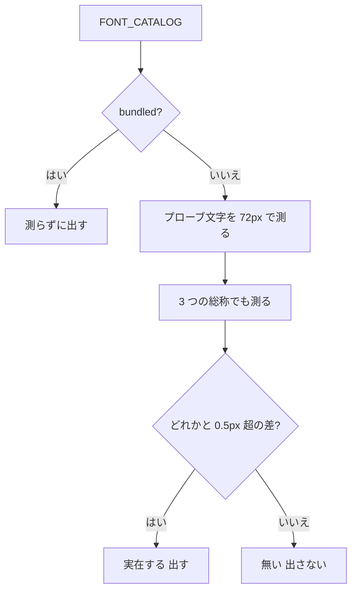
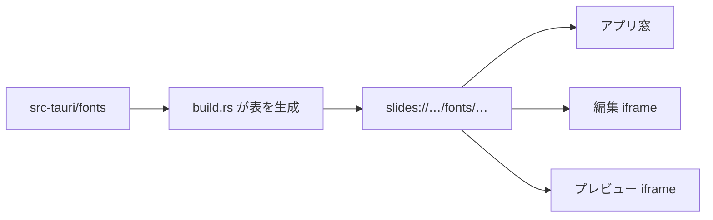

# fonts — 処理フロー

## メインフロー

同梱書体が実際に届くまでは別の流れ。**バイト列は Rust が持ち、URL は 3 面で同じ。**

## 異常系・エッジケース

| ケース | どうなるか |
|---|---|
| 測定手段が無い(`MeasureText` が null) | **カタログをそのまま出す。** 候補が空になって書体を一切選べなくなるほうが困る |
| macOS で `sans-serif` が和文ゴシック | 総称 1 つでは差が出ない。3 つすべてと比べて回避 |
| 同じ書体名が複数(游ゴシックの `YuGothic` / `Yu Gothic`) | カタログには両方載せ、**同じラベルは 1 エントリに畳む**。在るほうの `stack` が残る |
| デッキが `@font-face` を持っている | このカタログとは無関係。デッキ側の CSS はそのまま効く。同梱書体と**同じ名前**を宣言していれば、後に置かれるデッキ側が勝つ |
| `slides://` が無い(素のブラウザで `npm run dev`) | `assetBaseUrl()` が空なので `<link>` を差さない。スライドは同梱前と同じくシステム書体で描かれる |
| 書き出した HTML を別の機械で開く | 同梱書体は入っていない。`font-family` の後続(ヒラギノ・游ゴシック…)に落ちる |
| `src-tauri/fonts/` を差し替えたのに反映されない | 配信を長期キャッシュにしているため。WebView のキャッシュを捨てる([README](../../../src-tauri/fonts/README.md)) |
