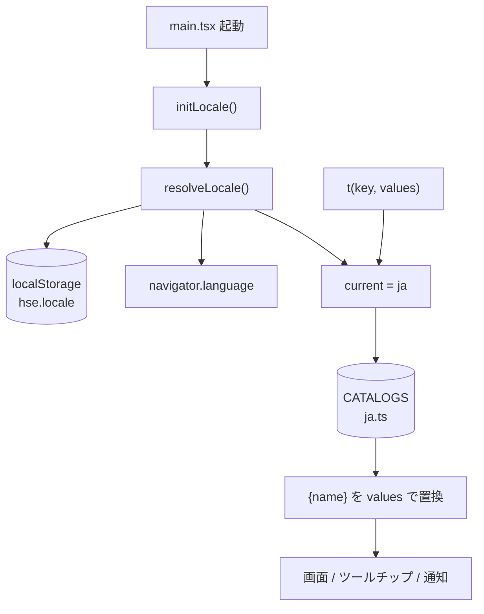
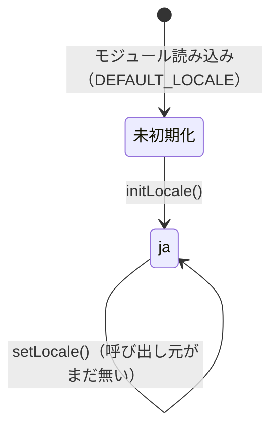

# i18n — 処理フロー

## メインフロー

言語は**起動時に 1 回決まり**、以降は `t()` がそのカタログを引くだけ。
カタログは「このキーの文面は何か」だけを答え、**いつ描くか・誰が読むかは呼び出し側**に残る。

- **`initLocale()` は render より前**（`src/main.tsx:9-11`）。Command のラベルは
  `readonly label = t('command.editText')` のように**インスタンス構築時**に確定するので、
  あとから言語が決まると、すでに作られたコマンドだけ古い言語のまま残る
- **`t()` は呼ぶたびカタログを引き直す**（`index.ts:56-62`）。値をモジュール読み込み時に
  固定していないので、言語が 2 つになったときの切替は**再描画**で足りる（[decisions.md](decisions.md) #4）
- 補間は `/\{(\w+)\}/g` の 1 回の `replace`（`index.ts:47`）。
  置換を駆動するのは**文面側のプレースホルダ**なので、`values` に余分なキーがあっても素通りする

`t()` を呼ぶのは `src/` の **32 ファイル**（テストを除く。`core` / `features` / `app` / `stage` / `import` に渡る）。
カタログの項目は **252 件**で、うち **22 件**が `{name}` を持つ。

## 異常系・エッジケース

| 状況 | 振る舞い |
| --- | --- |
| `localStorage` が読めない / 書けない（プライベートモード等） | `try` / `catch` で握りつぶし、`navigator.language` の判定へ落ちる。**起動は止めない**（`locale.ts:29-48`、[decisions.md](decisions.md) #9） |
| 保存値が `LOCALES` に無い文字列（手で書き換えた・古い版の値） | `isLocale()` が弾き、保存が無いのと同じ扱いになる |
| `navigator` が無い（jsdom の一部・非ブラウザ実行） | `preferred` を空文字にして `DEFAULT_LOCALE` へ落ちる |
| カタログを持たない言語の環境（`fr-FR` 等） | `LOCALES.find()` が一致せず**日本語で出る**。キーがそのまま出るよりまし（[decisions.md](decisions.md) #8） |
| 現在言語のカタログにキーが無い | 既定言語 → キー文字列そのもの、の順に落ちる（`index.ts:57`）。**今は言語が 1 つで型が防いでいる**ので、この経路は言語が増えたときの保険 |
| `{name}` に値が渡されなかった | **プレースホルダをそのまま残す**。空にしない（[decisions.md](decisions.md) #6） |
| カタログに無いキーを書いた | **コンパイルが通らない**（`t()` の引数が `MessageKey`）。実行時には起きない |
| 文面を並べて 1 文にする場面（取り込みの要約） | 区切り記号と語尾もカタログの項目を引く（`import.listSeparator` / `import.filledSummary`、`src/app/actions.ts:64`） |

## 状態遷移

**遷移は無い。** `current` は `initLocale()` で 1 回決まり、それきり変わらない。

`setLocale()` は書き出してあるが、**`src/` に呼び出し元は 1 つも無い** —— 言語切替 UI を
入れていないため（[decisions.md](decisions.md) #15）。カタログが 2 つ目になったら、
ここが「切替 → ストア更新 → 再描画」の入口になる。
