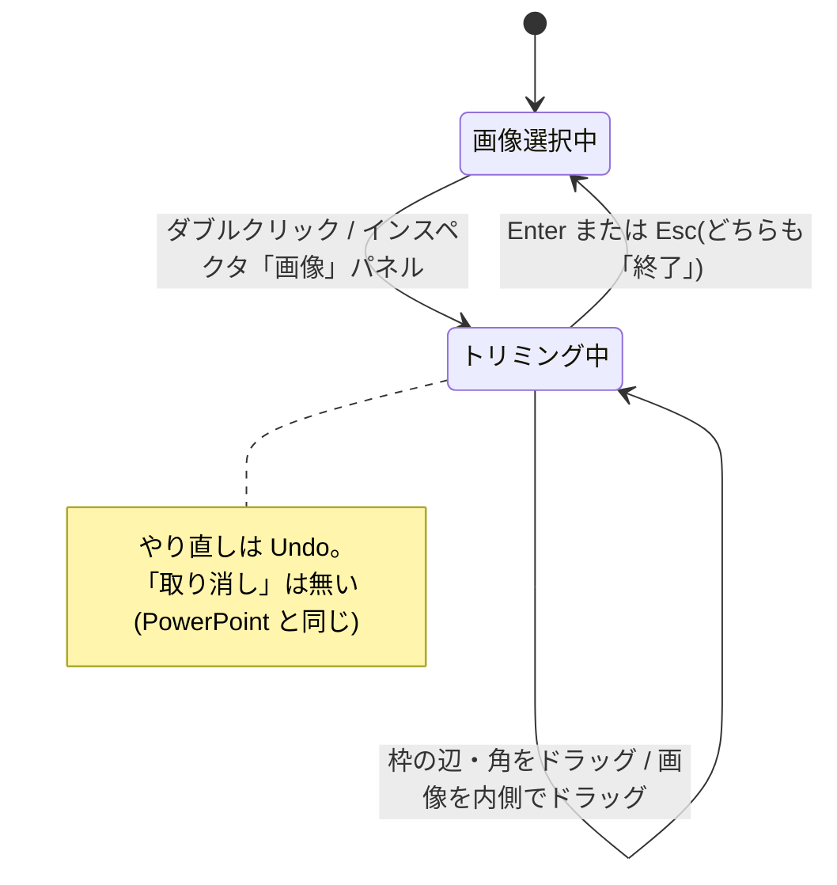
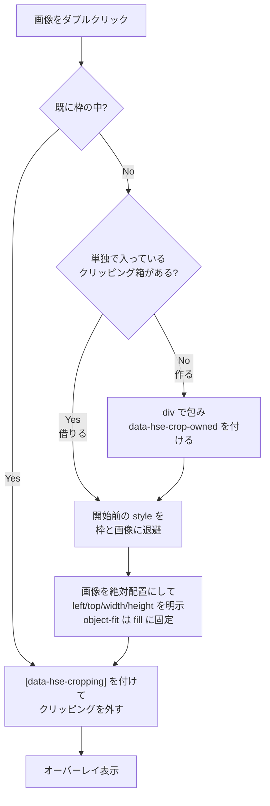
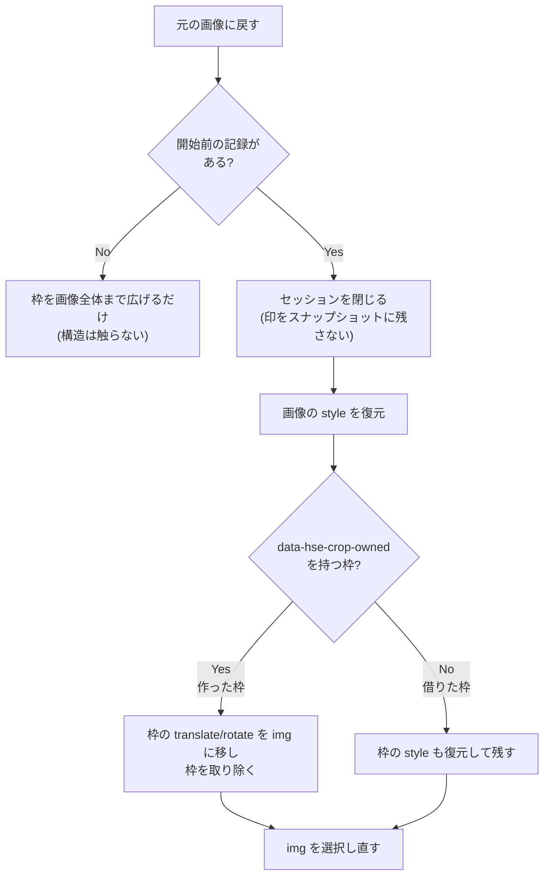
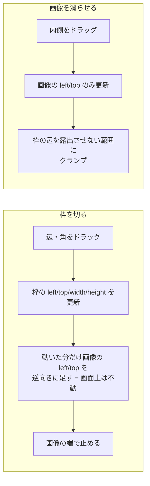

# image-crop — 処理フロー

## 状態遷移

## 開始フロー

**枠を作るのは借りられる箱が無いときだけ**(独立した undo ステップ)。
借りられる箱があるならそれが枠で、新しい `
` は挟まない — 挟むと**デッキ側の箱が
トリミング前の大きさのまま残る**。既に枠の中にある画像を開き直すのは編集ではないので、
構造も記録も触らない。`contain` の余白を詰めるのは**自分で作った枠だけ**。

**開始時に見た目を 1px も変えない**のが条件。`fill` に固定できるのは、
描画矩形を明示的に書いたあとは `object-fit` に仕事が無くなるため(同じ比率では同じ描画)。

## 解除フロー(「元の画像に戻す」)

## ジェスチャ

## 異常系・エッジケース

| 状況 | 挙動 |
|---|---|
| 辺を画像の外まで引こうとした | 画像の端で止める(**何も映さない枠を作らない**)。手前の辺も奥の辺も同じ |
| 枠を潰すほど詰めようとした | 最小サイズで止める |
| 画像が枠より大きい状態でスライドさせた | どの辺も露出しない範囲にクランプする |
| 画像が枠より小さい | 画像を枠の内側に留める |
| `object-position` が比率(`50% 50%`)/ 長さ(`10px 20px`)で指定されている | どちらも尊重する |
| 画像に固有サイズが無い(SVG 等) | 枠を埋める |
| `object-fit: scale-down` | **拡大はしない** |
| トリミング中に保存 / 自動保存が走った | `[data-hse-cropping]` はステージのスタイルシート側にあるので、`style` 属性には出ない。`data-hse-crop-origin` ともども、シリアライズが `data-hse-*` を落とすので痕跡が残らない |
| 解除しようとした枠に `data-hse-crop-origin` が無い | デッキ自身が書いた枠。**外さず**、画像全体まで広げるにとどめる |
| 同じ画像でトリミングを開き直した | 構造も開始前の記録も触らない。記録を上書きすると「開始前」がトリミング後にすり替わる |
| トリミング済みの画像をクリックした | 枠が選ばれる。画像を選ぶとトリミング前の矩形にハンドルが出てしまう |
| 借りようとした箱に他の子や自前のテキストがある | 借りない(画像を絶対配置にすると他の中身がずれる)。新しい枠を作る |
| 解除を Undo した | セッションを閉じてから記録しているので、戻ってきた枠に `data-hse-cropping` は付いていない |
| トリミングしたまま保存し、開き直してから解除した | 戻し先はシリアライズで落ちているので、上と同じくデッキ製の枠として扱う(広げるだけ)。読み直した時点で「包む前」は本当に分からない |
| 包む前の `` に `style` 属性が無かった | 空の `style=""` を残さず、属性ごと消す |
| トリミング中に枠を枠と判定する | `overflow: visible !important` が効いているので、`data-hse-cropping` を持つ要素はクリッピング済みとして扱う |
