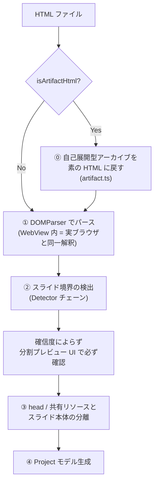
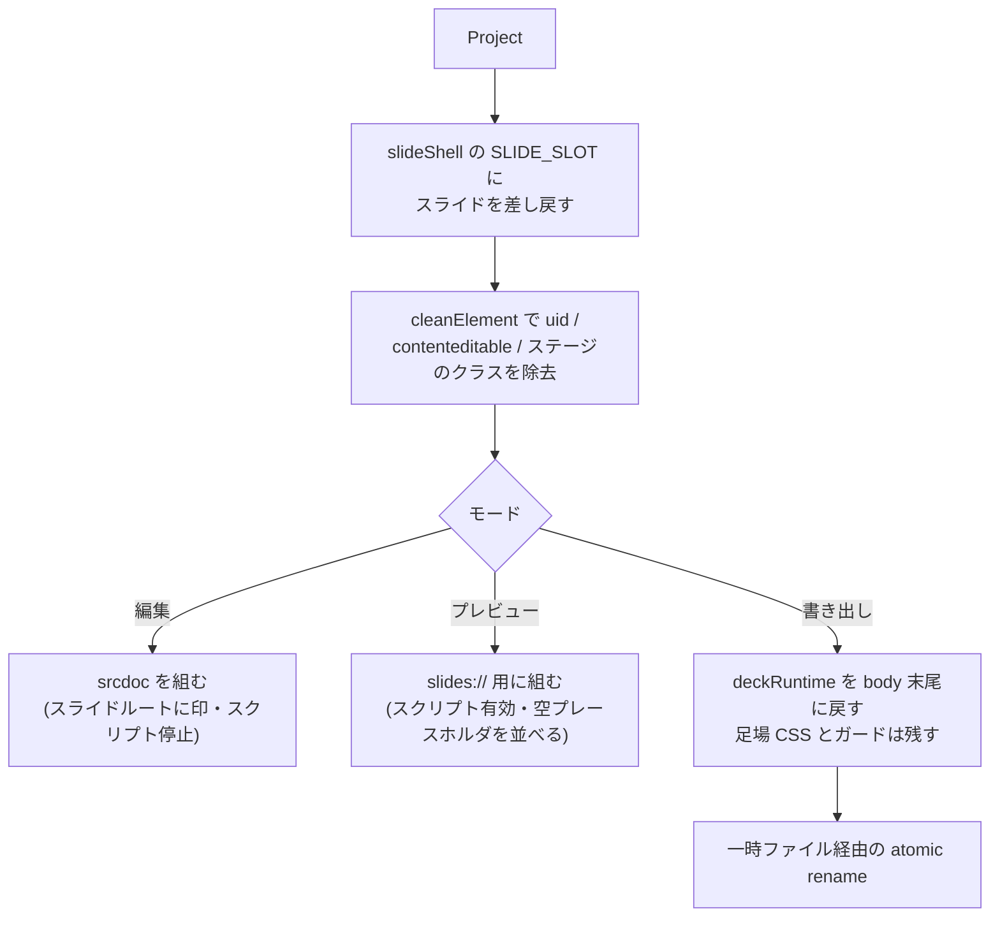
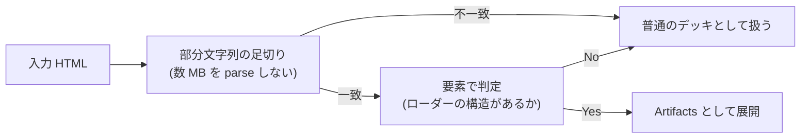

# import-pipeline — 処理フロー

## メインフロー

**確認は分岐しない。** どの候補がどれだけ確信を持っていても `ImportDialog` を必ず通す。
確認 1 枚は数秒だが、**間違った分割は手で戻すのが最も苦しい**取り込み失敗だから
([design.md](design.md) の「分割は確信度によらず必ず確認する」)。

③ の直前に `dropEditorScaffolding` が走り、`[data-hse-injected]` を持つ要素
(前回エディタが差し込んだ足場)を落とす。**次の合成で必ず作り直されるので失うものは無い。**

**アセット参照はどの段でも書き換えない。** 著者が書いた `file://` / 相対パス / `https://` は
そのまま残る([design.md](design.md) の「アセットの扱い」)。`assets/` はユーザーがエディタから
挿入した画像だけの置き場で、取り込みは通らない。

## 書き出し(合成)フロー

**プレビュー合成の足場(空プレースホルダ・ナビ注入)は preview モード限定。**
編集ステージや書き出し HTML に漏らさない。

## 異常系・エッジケース

| 状況 | 挙動 |
|---|---|
| どの Detector も確信できない | `single`(1 枚スライド扱い)が常に一致するので候補は必ず 1 つ以上ある。確認 UI に他の候補と並べて出し、ユーザーが選ぶ(**手動セレクタの入力欄は無い**) |
| Detector の推測が間違っている | 確認 UI が**別候補を提示**する。ユーザーが選び直せる |
| エディタが書き出した deck-stage デッキを再取り込み | `isArtifactHtml()` が**要素で判定**して弾く。文字列一致だけだと自分の書き出しを Artifacts と誤認し、**サブセット済みフォントをもう一度削る**(消えた文字のフェイスは戻らない) |
| Artifacts の `{{ 変数 }}` に宣言が無い | 空にせず `{{ }}` のまま残す。何が入るはずだったか読めなくなるため |
| manifest のエントリが gzip 圧縮されている | gunzip してからインライン化する |
| `@font-face` が `unicode-range` を宣言していない | 捨てずに残す(どの文字を覆うか判断できないため安全側) |
| 未圧縮エントリ | 既に base64 なのでそのまま使う(フォントと画像の通常ケース) |

## 誤認を避けるための二段判定

エディタが書き出した deck-stage デッキは、足場 CSS のセレクタとしても、
同梱したコンポーネントの usage コメントとしても `component-from-global-scope="deck-stage"`
という文字列を持つ。**だから文字列一致だけでは足りない。**
一方で数 MB のファイルを毎回 parse するのも避けたいので、部分文字列判定は高速な足切りとして前段に残す。
