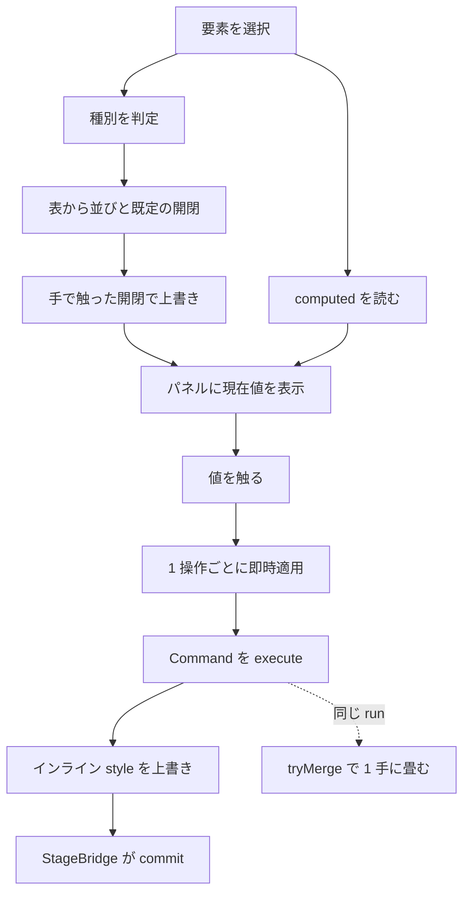
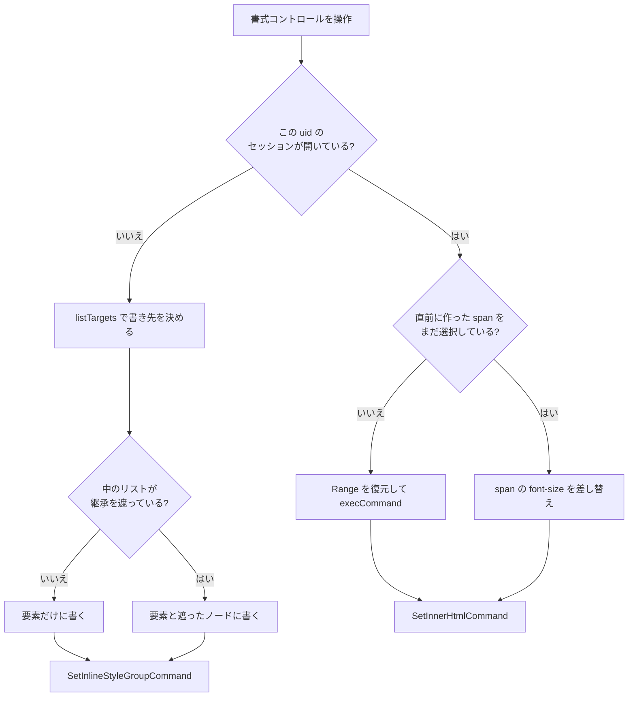
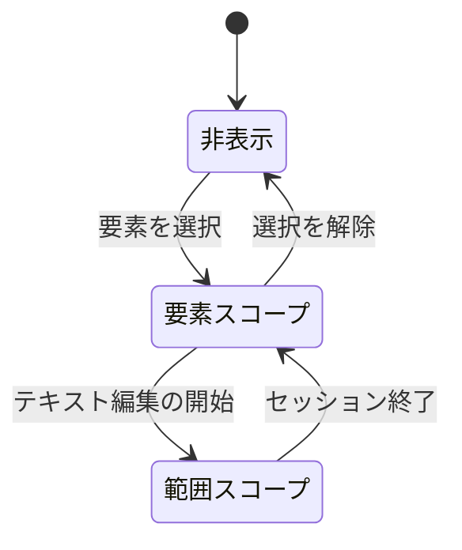

# inspector — フロー

## メインフロー(値の編集)

**確定操作を待つ欄はもう無い。** 色・太さ・余白・角丸・文字サイズに続いて
位置とサイズも打鍵ごとに当たるようになり([issues](../../issues.md) #38)、
数値欄は `LiveNumberInput` 1 つに揃った。連打が履歴を埋めないのは `tryMerge` の側の仕事で、
位置とサイズは `StyleSnapshotCommand` に渡す merge key(`geometry:<欄>:<uid>`)で run を区切る
([decisions.md](decisions.md) #48〜#50)。

**種別の判定と開閉はレンダリング中に決める**(computed の読み取りだけが effect)。
パネルの並びは列の骨格なので 1 レンダリング遅れると、選択を変えるたびに
前の要素の列が 1 フレーム描かれる。値の欄はどうせ次に上書きされるので遅れても構わない。

## メインフロー(文字書式)

右の枝を持つのは**サイズだけ**([decisions.md](decisions.md) #26)。
1 打鍵ごとに当たる欄なので、包み直しとフォーカス奪取をここで避ける。

分岐は `applyToScope` 1 箇所。**太さ・行揃えはこの分岐を通らず、常に左の枝**
([decisions.md](decisions.md) #18)。

左の枝の中の `listTargets` は**要素スコープの書き込みすべて**が通る
(`core/editing/listOverrides.ts`)。遮っているノードは実測で決め、
遮るものが無ければ書き先は要素 1 つに落ちる([decisions.md](decisions.md) #37〜#38)。
**ボックス系の欄(塗り・余白・枠線・不透明度)はこの図に載らない** —
継承しないので降ろす話が無く、`SetInlineStyleCommand` を直接使う。

Range の退避と復元が要るのは、ネイティブの select やカラーダイアログがフォーカスを奪い、
WebKit がその時点で iframe の選択範囲を失うため
([editing-engine/decisions.md](../editing-engine/decisions.md) #14)。
退避は `pointerdown` の時点、つまりフォーカスがまだ iframe にあるうちに行う。

**色のパレットを自前にしても、この手当ては外せない。** OS のダイアログは「その他の色」の奥に残っているし、
パレットのスウォッチは押した瞬間に範囲へ当てる。だから**分割ボタンの左右もスウォッチも
`pointerdown` を `preventDefault` する** — フォーカスを渡さなければ、退避に頼る前に範囲が生きたままになる。

## 異常系・エッジケース

| 状況 | 動作 |
| --- | --- |
| 値が継承・外部 CSS 由来 | 出所を表示し、読み取り専用として見せる |
| 打っている途中で別の要素を選んだ | **すでに当たっている。** 打鍵ごとに書くので、選択が動くより前に書き終わっている([decisions.md](decisions.md) #48) |
| 打鍵中に要素が違う値を返した | フォーカスがある間は欄の文字列を上書きしない。blur で同期し直す([decisions.md](decisions.md) #50) |
| 幅・高さに 0 や負を打った | 1px まで(`MIN_SIZE`)。掴む辺が無くなる |
| 数値欄にフォーカスしたまま ⌘Z した | ステージは戻るが、**欄の数字は blur するまで打った値のまま**([decisions.md](decisions.md) #50 の代償) |
| この環境に無いフォント | 一覧に出さない(`editing-engine` #21) |
| テキストセッションが閉じた | パネルはそのまま。フォント・色・サイズの当たる先が**選択要素まるごと**に変わる |
| 別の要素にセッションが開いたまま | uid が一致しないので要素スコープで当たる(横取りさせない) |
| 選択が無くなった | パネルごと消える(だから直前のサイズ・フォント・色は共有ストアに退避してある)。**開閉の記憶は残る** |
| 選択が別種別の要素へ移った | 並びと既定が入れ替わる。**手で触っていないパネルの開閉は上書きとして記録しない**(記録すると表が死ぬ。[decisions.md](decisions.md) #28〜#29) |
| ステージが uid を解決できない | 位置とサイズ・ボックス・枠線だけを出す(要素を読まずに済むパネル) |
| 保存された開閉に知らないパネル名が入っている | 捨てる(真偽値でない項目も同じ)。全部捨てても既定に戻るだけ |
| 文字を空にした箱 | 文字書式パネルが消える。ダブルクリックで入り直せないのと同じ判定なので、両方同時に起きる |
| computed がまだ届かない 1 レンダリング | seed しない(空から seed すると全要素が 28px になる) |
| サイズ適用でフォーカスが iframe へ移った | 数値欄へ戻す(戻さないと次の 1 文字が本文に入る) |
| サイズを打つ途中で欄が空・8 未満 | 空は何も当てない(`parseNumberDraft`)。範囲外は 8〜200 に丸めて当てる |
| 色のパレットを開いたまま Escape | セッションが終わり、パレットも閉じる(capture 段の `EditStage` が先、`useDismiss` が後)。**Escape はどの層でも「やめる」** |
| 範囲に色を当てたあと | バーは選んだ色のまま。要素の computed は変わらないので、要素を映すと 3 語塗った瞬間に戻ってしまう |
| computed が届く前に左ボタンを押した | 直前の要素の色が当たる。バーがその色を出しているので、**見えているとおりに動く** |
| 「その他の色」の OS ダイアログをドラッグ中 | ドラッグの各段階で当たる(`input` イベント)。スウォッチは 1 回で 1 コマンド |

## 状態遷移(「文字書式」パネル)

**どちらの状態でも操作を受け付ける。** 以前は「表示されているが当たる先が無い」状態があり、
そのぶんを下の「テキスト」パネルが埋めていた([decisions.md](decisions.md) #17)。

**描くものは状態で変わる。** 要素スコープでは範囲にしか効かないもの
(B / I / U / S・x²・解除・蛍光・箇条書き・番号・リンク)を出さない
([decisions.md](decisions.md) #22)。
非表示の切り替えは `useTextSession` の購読で起きる(同 #24)。

そもそも**「非表示」からこの図に入れない要素がある** — 自分の文字を持たない画像や図形では、
パネルごと出ない(同 #21)。

浮遊版があったころは「編集開始で出て、終了で消える」ものが別にあったが、廃止した
([decisions.md](decisions.md) #15)。
