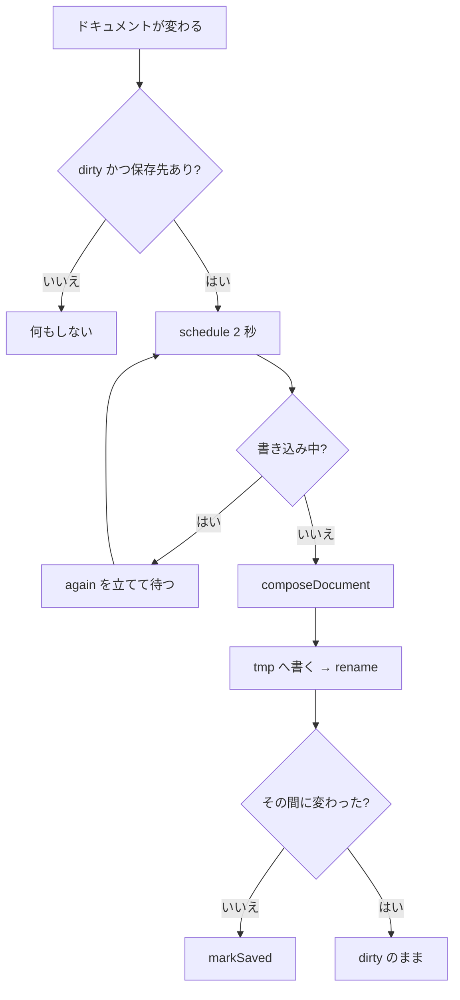
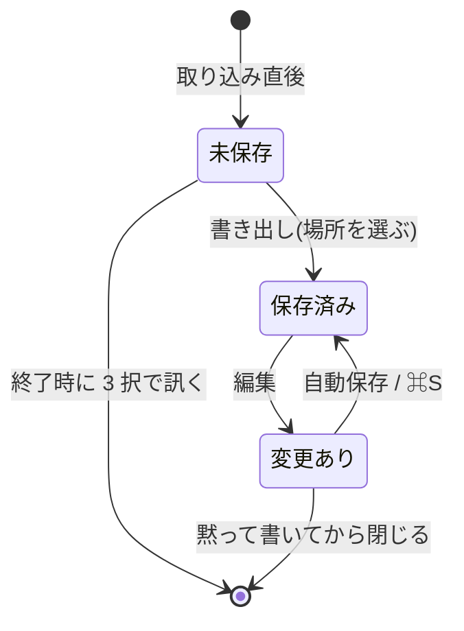

# persistence — 処理フロー

## メインフロー（自動保存）

## 異常系・エッジケース

| ケース | どうなるか |
|---|---|
| 書き込みに失敗 | `error` イベント → トースト。次の書き込みは止めない |
| 書き込み中にさらに編集 | `#again` で覚え、終わってから再スケジュール |
| 書いている間にドキュメントが動いた | `markSaved` しない。「保存済み」と嘘をつかない |
| ブラウザで動かしている(`npm run dev`) | `getCurrentWindow()` が例外 → 閉じる監視だけ諦める。自動保存自体は走る |
| 書き出しダイアログを閉じられた | `dirty` が残るので閉じない |
| 取り込んだ HTML が UTF-8 でない | `from_utf8_lossy`。1 バイトのせいで取り込みが止まるほうが困る |

## 状態遷移

