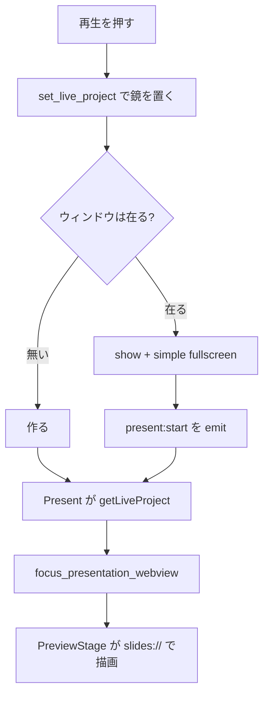
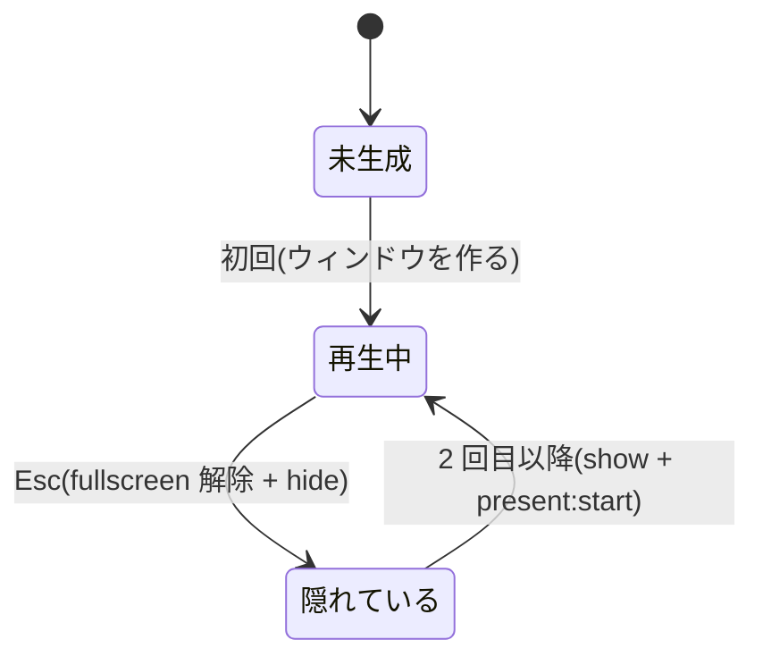

# presentation — 処理フロー

## メインフロー

## 異常系・エッジケース

| ケース | どうなるか |
|---|---|
| デッキの取得に失敗 | コンソールに出し、空のプロジェクトのまま。ウィンドウは残る |
| ブラウザで動かしている(`npm run dev`) | `getCurrentWindow()` が例外になる経路をすべて握り潰す(不変条件 11) |
| デッキの JS がスライド index で分岐する | プレースホルダを並べて index を再現する([roadmap](../../roadmap.md) のリスク表) |
| 再生中にクリックする | ホスト側のシールドが受ける。iframe にフォーカスを落とさない |

## 状態遷移

**「閉じた」状態は無い。** 作ったウィンドウは終了まで生き続ける(不変条件 16)。
