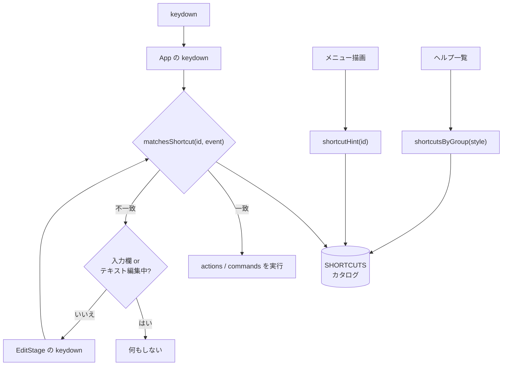
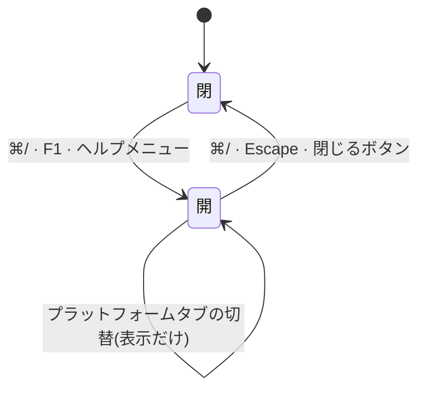

# shortcuts — 処理フロー

## メインフロー

キーが押されてから何かが起きるまで。カタログは「これは何のキーか」だけを答え、
「何をするか」はハンドラに残る。

窓口は 3 つ(App / EditStage / Present)のままで、**そこは今回変えていない**。
変わったのは、どの窓口も同じカタログに「これは何のキーか」を尋ねるようになったこと。

## 異常系・エッジケース

| 状況 | 振る舞い |
| --- | --- |
| 入力欄(`INPUT` / `TEXTAREA` / `SELECT`)にフォーカスがある | ⌘S・⌘Z・⌘/ の**手前で**早期 return。それ以外は編集を動かさない |
| テキスト編集セッション中(`activeTextSession()`) | 同上。iframe 内のキーはそもそもホストに届かない |
| ショートカット一覧が開いている | ⌘/ と Escape 以外を全部止める。モーダルの裏で編集が進まない |
| macOS で Ctrl を押した | 効く(`mod` は `metaKey \|\| ctrlKey`)。ただし一覧には ⌘ 表記だけを出す |
| JIS 配列で ⌘] を押した | 効く。括弧は `event.code` で見ている |
| テンキーの + / − / 0 | 効く。`hidden: true` の別名ストローク。一覧には出さない |
| `detectPlatform()` が判定できない | `linux` に倒れ、表記は `Ctrl+` 系。タブで切り替えられる |
| 同じキーを 2 つのエントリが持つ | `contextual: true` を宣言したものだけ許す。**宣言の無い衝突は unit テストが落とす** |

## 状態遷移

ヘルプ一覧の開閉だけ。状態は `uiStore.helpOpen` の 1 つ。

開いている間は他のショートカットを受け付けない。Escape は capture フェーズで
`stopPropagation()` するので、ステージの Escape(選択を 1 階層外へ)には届かない。
