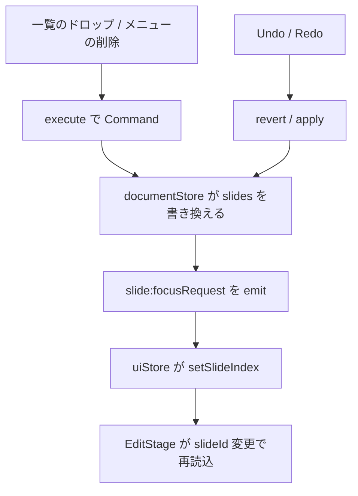

# slide-management — 処理フロー

## メインフロー

並べ替え・削除は、**どこから起きても同じ 1 本**を通る。
`slideIndex` を決めるのがコマンドの側にあるのが要点で、
これにより Undo(呼び出し元がいない)も同じ経路になる。

## 異常系・エッジケース

| ケース | どうなるか |
|---|---|
| 削除対象が既に無い(id が見つからない) | `apply` は何もせず戻る。`#removed` が null のままなので `revert` も何もしない |
| 最後の 1 枚を削除する | `slideIndex` は 0 に落ちる。一覧は空表示になる |
| 末尾のスライドを削除する | 1 つ手前(新しい末尾)を開く |
| 同じ位置へのドロップ | `from === index` で `SlideList` が握り潰し、コマンドを積まない |
| ドラッグ中の連続した並べ替え | `tryMerge` が最終地点だけを残す。ただし 800ms の merge 窓を過ぎたら別ステップ |

## 状態遷移

`slideIndex` は UI の状態であってドキュメントの内容ではないので、
書き出す HTML にも保存するプロジェクトにも入らない
([07-ui-system](../../basic-design/07-ui-system.md) の「ワークスペースの状態は書き出さない」)。
