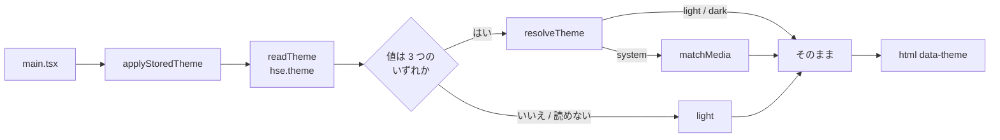
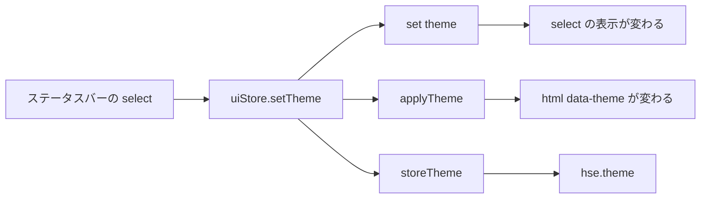
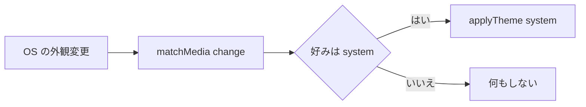

# theme — 処理フロー

## 起動

`applyStoredTheme()` は **`initLocale()` の隣**、`ReactDOM.createRoot` より前で呼ぶ。
**一度描いてから塗り替わるのは、間違った配色を見せたのと同じ**なので、
最初のフレームより前に属性を出す。

`uiStore` も同じ `readTheme()` を呼んで初期値を持つ（`localStorage` を 2 回読むだけで、
どちらも同じ答えを出す）。ストアの値は**ステータスバーが今どれを選んでいるか**を出すためのもので、
描画そのものは属性が決めている。

## 切り替え

3 つとも同期。debounce しない理由は [decisions.md](decisions.md) #6。

## OS の外観が変わったとき

監視は `uiStore` のモジュール末尾で**一度だけ**登録し、外さない。
`system` 以外を選んでいる間も OS は変わりうるので、**`system` に戻した瞬間に正しい答え**が要る。

## 異常系・エッジケース

| 起きること | どうなるか |
|---|---|
| `localStorage` が読めない（プライベートモード等） | 例外を握って `light`。**起動を妨げない**（ペイン幅・言語と同じ扱い） |
| `localStorage` が書けない | 握りつぶす。その回のセッションでは効いていて、次の起動で既定に戻る |
| 保存された値が `solarized` のような未知の文字列 | 捨てて `light`。将来テーマを消したときに、その名前が残っていても壊れない |
| `matchMedia` が無い（jsdom・表示のないホスト） | `system` は `light` として解決し、監視は**何もしない解除関数**を返す |
| 再生ウィンドウ（`#/present`） | 同じバンドルなので属性は付くが、`.present` が黒で覆うので**見た目は変わらない** |
