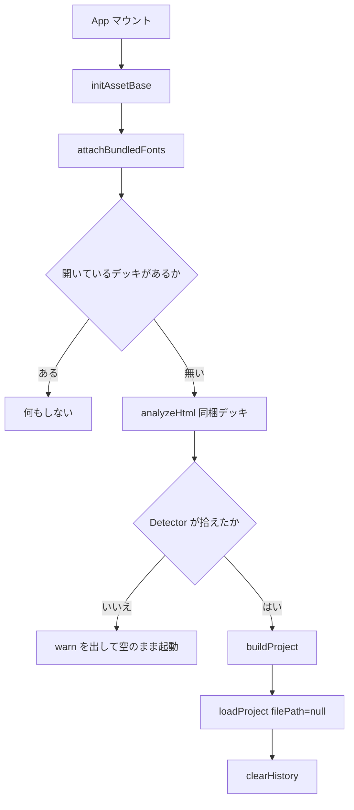
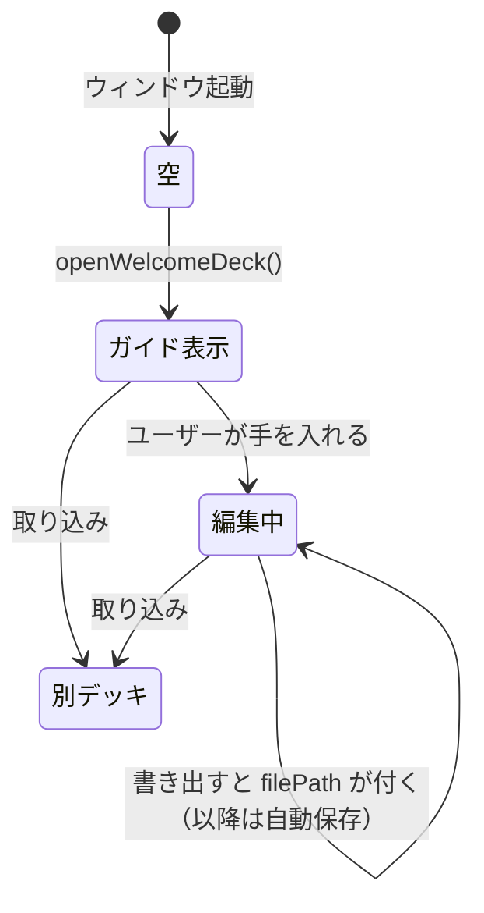

# welcome-deck — 処理フロー

## メインフロー

`analyzeHtml` → `buildProject` は取り込み（[import-pipeline](../import-pipeline/design.md)）と
同じ関数で、違うのは**入力がファイルではなくバンドルされた文字列**である点だけ。
確認ダイアログ（`ImportDialog`）は通らない —— 分割結果は
[test.md](test.md) の回帰テストで固定されており、ユーザーに選ばせるものが無いため。

## 異常系・エッジケース

| 起きること | どうする |
|---|---|
| どの Detector も拾えない | `console.warn` を残して**空のまま起動**する。ユーザーが操作できる類の失敗ではないので、トーストは出さない |
| StrictMode でエフェクトが 2 度走る | 2 度目は「開いているデッキがある」で弾かれる。1 度目に読み込んだものは残る |
| `initAssetBase` が失敗する（素のブラウザ） | `initAssetBase` は例外を出さず origin を空にするだけなので、デッキは同梱書体なしで開く |
| 起動直後にユーザーが取り込む | 取り込みが `loadProject` で置き換える。同梱デッキは書き出し先を持たないので、失われて困るものは無い |

## 状態遷移

**「ガイド表示」は未変更（`dirty=false`）・書き出し先なし**なので、
そのまま閉じても [persistence](../persistence/design.md) の終了確認は出ない。
手を入れた瞬間に、取り込んだデッキとまったく同じ扱いになる。
